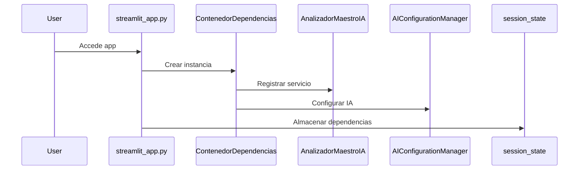
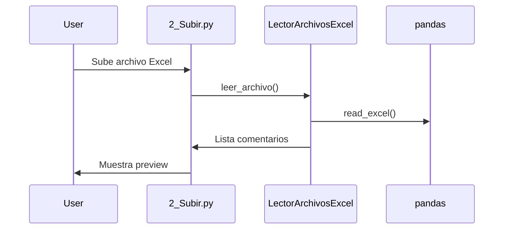
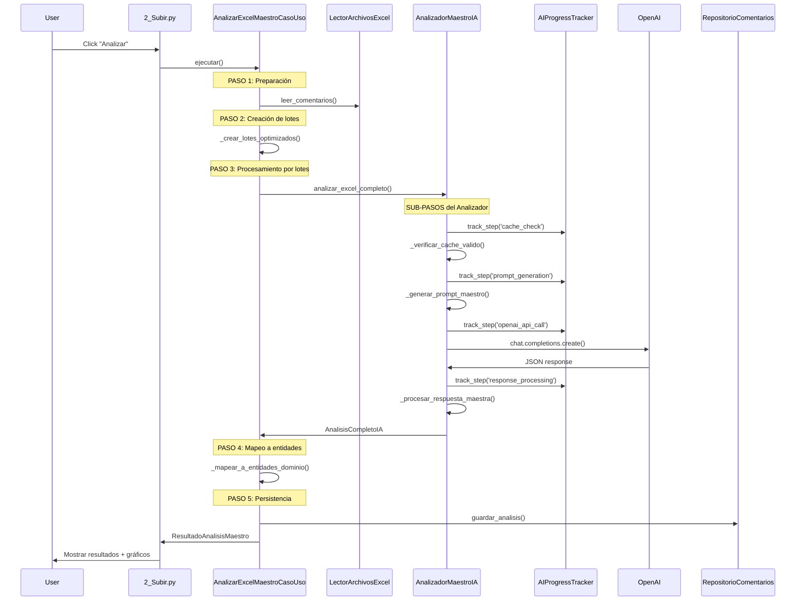
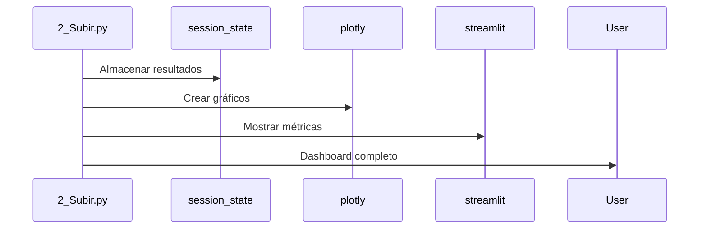

# 🚀 PIPELINE COMPLETO: Análisis de Comentarios con IA

## 📋 ÍNDICE
1. [Arquitectura General](#arquitectura-general)
2. [Flujo Principal](#flujo-principal)
3. [Mapeo Detallado de Módulos](#mapeo-detallado-de-módulos)
4. [Secuencia Completa de Ejecución](#secuencia-completa-de-ejecución)
5. [Componentes Críticos](#componentes-críticos)
6. [Flujo de Datos](#flujo-de-datos)

---

## 🏗️ ARQUITECTURA GENERAL

### **Patrón**: Clean Architecture + SOLID Principles
### **Estructura de Capas**:

```
streamlit_app.py (Punto de entrada)
├── pages/ (Interfaz de Usuario - Streamlit)
│   ├── 1_Página_Principal.py
│   ├── 2_Subir.py (Principal - Análisis)
│   └── 3_Analisis_Optimizada.py
├── components/ (Componentes UI reutilizables)
│   └── progress_tracker.py
└── src/ (Clean Architecture Core)
    ├── presentation/ (Capa de Presentación)
    ├── application/ (Casos de Uso)
    ├── domain/ (Lógica de Negocio)
    ├── infrastructure/ (Servicios Externos)
    └── shared/ (Utilidades Compartidas)
```

---

## 🔄 FLUJO PRINCIPAL

### **1. INICIALIZACIÓN** (`streamlit_app.py`)

```python
# PASO 1: Configuración inicial
streamlit_app.py:125-190
├── sys.path setup para imports
├── Carga configuración AI (secrets/env)
├── Valida configuración con _validate_and_log_deployment_config()
├── Inicializa ContenedorDependencias
└── Almacena en st.session_state
```

**Componentes clave inicializados:**
- `ContenedorDependencias`: Inyección de dependencias
- `AnalizadorMaestroIA`: Motor principal de análisis
- `AIConfigurationManager`: Configuración centralizada
- CSS y UI components

### **2. NAVEGACIÓN A PÁGINA ANÁLISIS** (`pages/2_Subir.py`)

```python
# PASO 2: Interfaz de usuario
pages/2_Subir.py:1-100
├── Carga CSS enhanced (glass morphism)
├── Importa excepciones y utilidades
├── Configura interfaz de subida de archivos
└── Preparación para análisis
```

### **3. EJECUCIÓN ANÁLISIS** (`pages/2_Subir.py:200-280`)

```python
# PASO 3: Trigger del análisis
_run_analysis()
├── Obtiene caso_uso_maestro del session_state
├── Crea ComandoAnalisisExcelMaestro
├── Inicializa progress tracker en UI
├── Ejecuta: caso_uso_maestro.ejecutar(comando)
└── Procesa resultado y muestra en UI
```

---

## 🗂️ MAPEO DETALLADO DE MÓDULOS

### **A. CAPA DE APLICACIÓN (`src/application/`)**

#### **Casos de Uso Principales:**

**1. `analizar_excel_maestro_caso_uso.py`**
- **Clase:** `AnalizarExcelMaestroCasoUso`
- **Método principal:** `ejecutar(ComandoAnalisisExcelMaestro)`
- **Responsabilidad:** Orquestar todo el proceso de análisis

```python
FLUJO INTERNO:
ejecutar() -> líneas 150-280
├── _validar_archivo() (línea 290)
├── _leer_comentarios() (línea 350) 
├── _procesar_lotes() (línea 400)
│   ├── _crear_lotes_optimizados() (línea 500)
│   └── _procesar_lotes_secuencial() (línea 600)
├── _mapear_a_entidades_dominio() (línea 700)
└── _guardar_en_repositorio() (línea 800)
```

#### **DTOs (Data Transfer Objects):**

**1. `analisis_completo_ia.py`**
- **Clase:** `AnalisisCompletoIA`
- **Uso:** Resultado estructurado del AnalizadorMaestroIA
- **Campos críticos:** 
  - `comentarios_analizados`
  - `distribucion_sentimientos`
  - `emociones_predominantes`
  - `confianza_general`

### **B. CAPA DE DOMINIO (`src/domain/`)**

#### **Entidades:**
- `comentario.py` - Representa comentario individual
- `analisis_comentario.py` - Análisis completo de comentario

#### **Value Objects:**
- `sentimiento.py` - Sentimientos categóricos
- `emocion.py` - Emociones granulares
- `tema_principal.py` - Temas detectados
- `punto_dolor.py` - Puntos de dolor identificados

#### **Servicios de Dominio:**
- `analizador_sentimientos.py` - Lógica de análisis

### **C. CAPA DE INFRAESTRUCTURA (`src/infrastructure/`)**

#### **Servicios Externos más Críticos:**

**1. `analizador_maestro_ia.py`**
- **Clase:** `AnalizadorMaestroIA`
- **Método principal:** `analizar_excel_completo(comentarios_raw)`
- **Pasos internos:**
```python
analizar_excel_completo() -> líneas 228-330
├── Validación y límites de seguridad (líneas 245-280)
├── track_step('cache_check') -> _verificar_cache_valido()
├── track_step('prompt_generation') -> _generar_prompt_maestro()
├── track_step('openai_api_call') -> _hacer_llamada_api_maestra()
└── track_step('response_processing') -> _procesar_respuesta_maestra()
```

**2. `ai_progress_tracker.py`**
- **Clase:** `AIProgressTracker`
- **Función:** Seguimiento en tiempo real del progreso
- **Pasos tracked:**
  - initialization (2%)
  - cache_check (3%)
  - prompt_generation (10%)
  - openai_api_call (75% - MÁS LENTO)
  - response_processing (8%)
  - emotion_extraction (2%)

**3. `ai_engine_constants.py`**
- **Clase:** `AIEngineConstants`
- **Constantes críticas:**
  - `SAFETY_COMMENT_LIMIT = 60`
  - `BASE_TOKENS_JSON_STRUCTURE = 1200`
  - `TOKENS_PER_COMMENT = 80`

#### **Inyección de Dependencias:**

**1. `contenedor_dependencias.py`**
- **Clase:** `ContenedorDependencias`
- **Patrón:** Singleton + Factory
- **Thread-safe** para Streamlit multi-user

#### **File Handlers:**
- `lector_archivos_excel.py` - Lectura de Excel/CSV

---

## 🎯 SECUENCIA COMPLETA DE EJECUCIÓN

### **FASE 1: INICIALIZACIÓN** (Tiempo: ~1-2s)


### **FASE 2: CARGA DE ARCHIVO** (Tiempo: <1s)


### **FASE 3: ANÁLISIS CON IA** (Tiempo: 5-30s según archivo)


### **FASE 4: VISUALIZACIÓN** (Tiempo: 1-3s)


---

## ⚙️ COMPONENTES CRÍTICOS

### **1. MOTOR DE ANÁLISIS IA**
```
AnalizadorMaestroIA (src/infrastructure/external_services/analizador_maestro_ia.py)
├── Método: analizar_excel_completo()
├── Cache: LRU + TTL para optimización
├── Límites: Adaptive safety nets
├── Deterministic: seed + temperature=0.0
└── Retry: Intelligent retry con backoff
```

### **2. PROGRESS TRACKING**
```
AIProgressTracker (src/infrastructure/external_services/ai_progress_tracker.py)
├── 6 pasos trackeable
├── Estimación tiempo real
├── Updates via Streamlit session_state
└── Auto-refresh cada 1 segundo
```

### **3. DEPENDENCY INJECTION**
```
ContenedorDependencias (src/infrastructure/dependency_injection/contenedor_dependencias.py)
├── Thread-safe singletons
├── Factory pattern
├── Lazy loading
└── Configuration injection
```

---

## 📊 FLUJO DE DATOS

### **Entrada:** `Archivo Excel/CSV`
```
Excel/CSV → LectorArchivosExcel → List[str] comentarios_raw
```

### **Procesamiento:** `Análisis IA`
```
List[str] → AnalizadorMaestroIA → AnalisisCompletoIA
                ↓
        OpenAI GPT-4/GPT-4o-mini
                ↓
        JSON estructurado:
        {
          "general": {...},
          "comentarios": [...],
          "stats": {...}
        }
```

### **Mapeo:** `IA → Dominio`
```
AnalisisCompletoIA → List[AnalisisComentario] (Entidades de dominio)
                           ↓
                  RepositorioComentarios (Persistencia)
```

### **Salida:** `Dashboard UI`
```
List[AnalisisComentario] → Gráficos Plotly + Métricas Streamlit
                                  ↓
                             Dashboard interactivo
```

---

## 🎯 CONFIGURACIÓN CRÍTICA

### **Límites de Seguridad:**
- `ULTIMATE_SAFETY`: 60 comentarios máximo por lote
- `ADAPTIVE_SAFETY`: 55 comentarios para 8K tokens
- `PRODUCTION_SAFE_LIMIT`: 12,000 tokens máximo

### **Modelos IA Soportados:**
- `gpt-4o-mini` (por defecto - más rápido)
- `gpt-4` (más preciso)
- `gpt-4-turbo` (balance)

### **Configuración Determinística:**
- `temperature = 0.0`
- `seed = 12345`
- `response_format = "json_object"`

---

## 📈 MÉTRICAS DE PERFORMANCE

### **Tiempos Típicos:**
- **Archivo pequeño** (10-20 comentarios): 5-8 segundos
- **Archivo mediano** (30-50 comentarios): 10-20 segundos  
- **Archivo grande** (50-60 comentarios): 20-35 segundos

### **Distribución de tiempo:**
- Cache check: 3%
- Prompt generation: 10%
- **OpenAI API call: 75%** ← BOTTLENECK
- Response processing: 10%
- Emotion extraction: 2%

---

## 🔧 PUNTOS DE EXTENSIÓN

### **Para añadir nuevas funcionalidades:**
1. **Nuevos análisis**: Extender `AnalizadorMaestroIA._generar_prompt_maestro()`
2. **Nuevas métricas**: Añadir campos a `AnalisisCompletoIA`
3. **Nuevos formatos**: Implementar `ILectorArchivos`
4. **Nueva UI**: Crear páginas en `pages/`

### **Para optimización:**
1. **Cache**: Configurar TTL en `AIEngineConstants`
2. **Lotes**: Ajustar `SAFETY_COMMENT_LIMIT`
3. **Modelos**: Cambiar modelo en configuración
4. **Paralelismo**: Implementar async en `AnalizadorMaestroIA`

---

*Documentación generada automáticamente - Mantener actualizada con cambios de código*