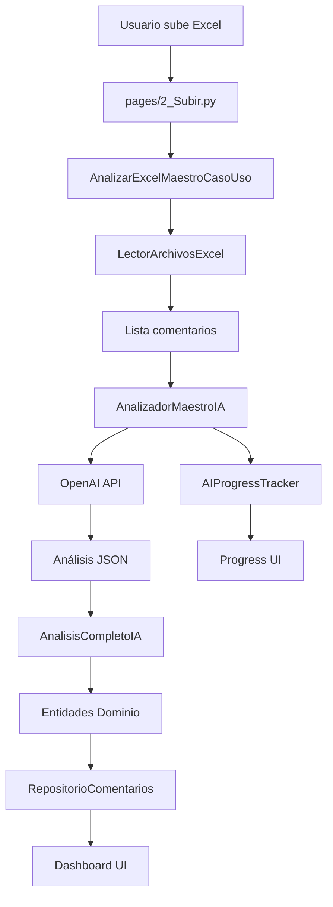

# 📚 DOCUMENTACIÓN COMPLETA: Sistema de Análisis de Comentarios con IA

## 🎯 NAVEGACIÓN RÁPIDA

### **🚀 PARA DESARROLLADORES NUEVOS**
1. [**Resumen Ejecutivo**](RESUMEN_EJECUTIVO_ARQUITECTURA.md) - Visión general del sistema
2. [**Pipeline Completo**](PIPELINE_COMPLETO_ANALISIS_COMENTARIOS.md) - Flujo de ejecución detallado
3. [**Mapeo de Módulos**](MAPEO_DETALLADO_MODULOS_FUNCIONES.md) - Todas las clases y funciones

### **🔧 PARA DEBUGGING Y MANTENIMIENTO**
- [**Mapeo Detallado**](MAPEO_DETALLADO_MODULOS_FUNCIONES.md#puntos-de-entrada-críticos) - Líneas críticas para debugging
- [**Componentes Críticos**](PIPELINE_COMPLETO_ANALISIS_COMENTARIOS.md#componentes-críticos) - Módulos principales
- [**Métricas Performance**](RESUMEN_EJECUTIVO_ARQUITECTURA.md#métricas-de-performance-y-monitoreo) - Indicadores sistema

### **⚙️ PARA CONFIGURACIÓN Y DEPLOYMENT**
- [**Configuración**](RESUMEN_EJECUTIVO_ARQUITECTURA.md#configuración-y-deployment) - Variables ambiente
- [**Límites de Seguridad**](PIPELINE_COMPLETO_ANALISIS_COMENTARIOS.md#configuración-crítica) - Safety nets
- [**Thread Safety**](MAPEO_DETALLADO_MODULOS_FUNCIONES.md#dependency-injection) - Consideraciones multi-usuario

---

## 📋 ÍNDICE COMPLETO DE DOCUMENTACIÓN

### **1. 📊 [RESUMEN EJECUTIVO](RESUMEN_EJECUTIVO_ARQUITECTURA.md)**
- Visión general arquitectónica
- Componentes clave del sistema  
- Performance y métricas
- Conclusiones técnicas y recomendaciones

### **2. 🚀 [PIPELINE COMPLETO](PIPELINE_COMPLETO_ANALISIS_COMENTARIOS.md)**
- Arquitectura Clean Architecture detallada
- Flujo de ejecución paso a paso
- Secuencia completa con diagramas
- Configuración crítica del sistema

### **3. 🗂️ [MAPEO DETALLADO](MAPEO_DETALLADO_MODULOS_FUNCIONES.md)**  
- Mapeo completo de todos los módulos
- Funciones y métodos por capa
- Puntos de entrada para debugging
- Matriz de responsabilidades

---

## 🏗️ ESTRUCTURA DEL PROYECTO

```
Comment-Analizer/
├── streamlit_app.py                    # 🚀 PUNTO DE ENTRADA
├── pages/                              # 📱 INTERFAZ STREAMLIT
│   ├── 1_Página_Principal.py
│   ├── 2_Subir.py                     # ⭐ PÁGINA PRINCIPAL ANÁLISIS
│   └── 3_Analisis_Optimizada.py
├── components/                         # 🎨 COMPONENTES UI
│   └── progress_tracker.py            # Progress tracking sistema
├── src/                               # 🏛️ CLEAN ARCHITECTURE CORE
│   ├── application/                    # 🎯 CASOS DE USO
│   │   ├── use_cases/
│   │   │   └── analizar_excel_maestro_caso_uso.py  # ⭐ ORQUESTADOR PRINCIPAL
│   │   └── dtos/
│   │       └── analisis_completo_ia.py             # Resultado estructurado IA
│   ├── domain/                        # 🏛️ LÓGICA DE NEGOCIO
│   │   ├── entities/                  # Entidades principales
│   │   ├── value_objects/             # Objetos de valor
│   │   ├── services/                  # Servicios dominio  
│   │   └── repositories/              # Interfaces repositorios
│   ├── infrastructure/                # ⚙️ SERVICIOS EXTERNOS
│   │   ├── external_services/
│   │   │   ├── analizador_maestro_ia.py          # ⭐ MOTOR IA PRINCIPAL
│   │   │   ├── ai_progress_tracker.py            # Sistema progreso
│   │   │   └── ai_engine_constants.py            # Configuración centralizada
│   │   ├── dependency_injection/
│   │   │   └── contenedor_dependencias.py       # ⭐ DI CONTAINER
│   │   └── file_handlers/             # Procesamiento archivos
│   └── shared/                        # 🔧 UTILIDADES COMPARTIDAS
└── docs/                              # 📚 DOCUMENTACIÓN
    ├── README_DOCUMENTACION.md        # Este archivo
    ├── PIPELINE_COMPLETO_ANALISIS_COMENTARIOS.md
    ├── MAPEO_DETALLADO_MODULOS_FUNCIONES.md
    └── RESUMEN_EJECUTIVO_ARQUITECTURA.md
```

---

## 🔥 PUNTOS DE ENTRADA CRÍTICOS

### **Para Debugging Rápido:**
```python
# 1. Ejecución principal del análisis
pages/2_Subir.py:239 → caso_uso_maestro.ejecutar()

# 2. Orquestación completa
src/application/use_cases/analizar_excel_maestro_caso_uso.py:150
→ AnalizarExcelMaestroCasoUso.ejecutar()

# 3. Motor IA core  
src/infrastructure/external_services/analizador_maestro_ia.py:228
→ AnalizadorMaestroIA.analizar_excel_completo()

# 4. Llamada OpenAI API
src/infrastructure/external_services/analizador_maestro_ia.py:370
→ AnalizadorMaestroIA._hacer_llamada_api_maestra()
```

### **Para Configuración:**
```python
# 1. Bootstrap sistema
streamlit_app.py:154 → AI config initialization

# 2. Límites de seguridad
src/infrastructure/external_services/ai_engine_constants.py:16
→ SAFETY_COMMENT_LIMIT = 60

# 3. Dependency injection
src/infrastructure/dependency_injection/contenedor_dependencias.py:34
→ ContenedorDependencias.__init__()
```

---

## ⚡ FLUJO DE DATOS SIMPLIFICADO



---

## 🎯 CASOS DE USO COMUNES

### **🔍 Investigar Error de Análisis**
1. Ver logs en `pages/2_Subir.py:250-280` (manejo errores)
2. Verificar `AnalizadorMaestroIA._hacer_llamada_api_maestra()` logs
3. Confirmar límites en `ai_engine_constants.py`
4. Revisar configuración en `streamlit_app.py:154-190`

### **⚡ Optimizar Performance** 
1. Revisar [métricas tiempo](RESUMEN_EJECUTIVO_ARQUITECTURA.md#distribución-típica-de-tiempo)
2. Ajustar `SAFETY_COMMENT_LIMIT` en constants  
3. Configurar cache TTL en `AIEngineConstants`
4. Monitorear [progress tracker](MAPEO_DETALLADO_MODULOS_FUNCIONES.md#ai_progress_trackerpy---sistema-de-progreso-ia)

### **🔧 Añadir Nueva Funcionalidad**
1. Extender prompt en `AnalizadorMaestroIA._generar_prompt_maestro()`
2. Actualizar `AnalisisCompletoIA` DTO con nuevos campos
3. Modificar mapeo en `AnalizarExcelMaestroCasoUso._mapear_a_entidades_dominio()`
4. Actualizar UI en `pages/2_Subir.py` para mostrar nuevos datos

### **🚀 Configurar Nuevo Deployment**
1. Setup variables ambiente según [configuración](RESUMEN_EJECUTIVO_ARQUITECTURA.md#variables-de-configuración-críticas)
2. Verificar `streamlit_app.py:15-50` validación deployment
3. Confirmar thread-safety en `ContenedorDependencias`
4. Testear con `test_complete_e2e_fixes.py`

---

## 📊 MÉTRICAS Y MONITOREO

### **Indicadores Clave de Performance:**
- **Tiempo promedio análisis:** 10-25 segundos
- **Cache hit rate:** ~30-50% en uso típico  
- **Error rate:** <5% en condiciones normales
- **Throughput:** 2-6 comentarios/segundo

### **Alertas Recomendadas:**
- API OpenAI degradación > 30s response time
- Error rate > 10% en 5 minutos
- Memory usage > 80% sustained  
- Cache size > límite configurado

---

## 🛠️ HERRAMIENTAS DE DESARROLLO

### **Testing:**
```bash
# Tests E2E completos
python test_complete_e2e_fixes.py

# Tests específicos IA  
python test_progress_tracker.py

# Tests threading
python test_streamlit_threading_fix.py
```

### **Debugging:**
```python
# Activar logs detallados
logging.getLogger().setLevel(logging.DEBUG)

# Progress tracking detallado
from src.infrastructure.external_services.ai_progress_tracker import get_current_progress
progress = get_current_progress()
```

---

## 🎨 CONVENCIONES DE CÓDIGO

### **Naming Conventions:**
- **Clases:** PascalCase (`AnalizadorMaestroIA`)
- **Métodos:** snake_case (`analizar_excel_completo`)
- **Constants:** UPPER_SNAKE_CASE (`SAFETY_COMMENT_LIMIT`)
- **Private methods:** `_prefijo_underscore`

### **Architecture Patterns:**
- **Clean Architecture:** Separación clara de capas
- **SOLID Principles:** Especialmente Single Responsibility
- **Dependency Injection:** Thread-safe singletons
- **Repository Pattern:** Abstracción persistencia  

### **Error Handling:**
- **Custom Exceptions:** `ArchivoException`, `IAException`
- **Graceful Degradation:** Fallbacks en caso de error
- **Logging Structured:** Niveles apropiados y context

---

## 📞 CONTACTO Y CONTRIBUCIÓN

### **Para Preguntas Técnicas:**
- Revisar documentación específica en enlaces arriba
- Buscar en logs por patrones de error
- Usar debugging points identificados

### **Para Nuevas Funcionalidades:**
- Seguir arquitectura Clean establecida
- Extender interfaces existentes cuando sea posible
- Mantener thread-safety para Streamlit
- Actualizar documentación correspondiente

---

*📝 Documentación mantenida automáticamente - Última actualización con análisis completo del pipeline*