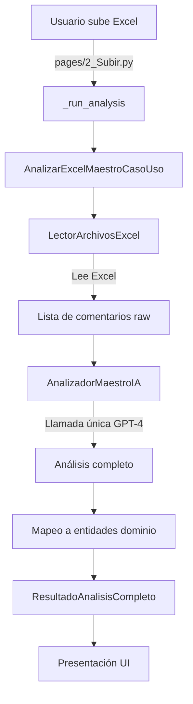

# 📘 ARQUITECTURA ACTUAL COMPLETA - Análisis E2E
**Fecha:** 2025-09-04
**Versión:** 3.0.0-ia-pure

---

## 🎯 RESUMEN EJECUTIVO

Este documento presenta un análisis End-to-End completo del sistema Comment Analyzer, identificando la arquitectura actual, flujos de datos, y problemas críticos que afectan el despliegue.

### Estado Actual
- **Arquitectura:** Clean Architecture + DDD + Sistema IA Puro
- **Stack Tecnológico:** Python 3.10+, Streamlit, OpenAI GPT-4
- **Problemas Críticos:** 5 patrones de variables no definidas

---

## 🏗️ ESTRUCTURA DE CAPAS

### 1. CAPA DE PRESENTACIÓN (`/pages`, `/streamlit_app.py`)
```
streamlit_app.py
├── Inicialización del sistema IA
├── Configuración de dependencias
├── Gestión de CSS/Glassmorphism
└── Navegación multi-página

pages/
├── 1_Página_Principal.py  → Landing page
└── 2_Subir.py             → Upload & Analysis
```

**Responsabilidades:**
- Interfaz de usuario con Streamlit
- Gestión de estado de sesión
- Carga de CSS y estilos visuales
- Manejo de uploads de archivos

### 2. CAPA DE APLICACIÓN (`/src/application`)
```
application/
├── use_cases/
│   ├── analizar_excel_maestro_caso_uso.py  → Caso de uso IA maestro
│   └── analizar_comentarios_caso_uso.py     → Caso de uso legacy
├── interfaces/
│   ├── lector_archivos.py
│   ├── procesador_texto.py
│   └── detector_temas.py
└── dtos/
    └── resultado_analisis.py
```

**Responsabilidades:**
- Orquestación de procesos de negocio
- Coordinación entre capas
- Transformación de datos entre capas

### 3. CAPA DE DOMINIO (`/src/domain`)
```
domain/
├── entities/
│   ├── comentario.py
│   └── resultado_analisis.py
├── value_objects/
│   ├── sentimiento.py
│   ├── tema.py
│   ├── emocion.py
│   └── punto_dolor.py
├── services/
│   └── analizador_sentimientos.py
└── repositories/
    └── repositorio_comentarios.py
```

**Responsabilidades:**
- Lógica de negocio central
- Entidades y objetos de valor
- Reglas de dominio
- Interfaces de repositorios

### 4. CAPA DE INFRAESTRUCTURA (`/src/infrastructure`)
```
infrastructure/
├── external_services/
│   ├── analizador_maestro_ia.py     → IA principal con GPT-4
│   └── analizador_openai.py         → Wrapper OpenAI
├── file_handlers/
│   └── lector_archivos_excel.py     → Lectura Excel/CSV
├── repositories/
│   └── repositorio_comentarios_memoria.py
├── text_processing/
│   └── procesador_texto_basico.py
└── dependency_injection/
    └── contenedor_dependencias.py   → DI Container
```

**Responsabilidades:**
- Integración con servicios externos
- Implementaciones concretas
- Persistencia y caché
- Inyección de dependencias

### 5. CAPA DE RECURSOS ESTÁTICOS (`/static`)
```
static/
├── main.css
├── styles.css
└── css/
    ├── glassmorphism.css    → Efectos de cristal
    ├── core.css
    └── [componentes...]
```

---

## 🔄 FLUJO DE DATOS PRINCIPAL

### Flujo de Análisis con IA Maestro



### Detalle del Flujo

1. **Carga del archivo** (`pages/2_Subir.py:287`)
   ```python
   _run_analysis(uploaded_file, "ai")
   ```

2. **Caso de uso maestro** (`analizar_excel_maestro_caso_uso.py:93-125`)
   ```python
   comando = ComandoAnalisisExcelMaestro(archivo_cargado, nombre_archivo)
   resultado = caso_uso_maestro.ejecutar(comando)
   ```

3. **Lectura de archivo** (`lector_archivos_excel.py`)
   ```python
   comentarios_raw_data = lector.leer_comentarios(archivo)
   # Returns: List[Dict[str, Any]]
   ```

4. **Análisis IA** (`analizador_maestro_ia.py:89-130`)
   ```python
   analisis_completo = analizador.analizar_excel_completo(comentarios_texto)
   # UNA sola llamada a GPT-4
   ```

5. **Respuesta y mapeo** 
   ```python
   ResultadoAnalisisCompleto(
       analisis_completo_ia=AnalisisCompletoIA(...),
       comentarios_analizados=List[Comentario]
   )
   ```

---

## 🐛 PROBLEMAS CRÍTICOS IDENTIFICADOS

### PROBLEMA 1: Variable no definida en AnalizadorMaestroIA
**Severidad:** 🔴 CRÍTICA - Causa crash en runtime

**Archivo:** `src/infrastructure/external_services/analizador_maestro_ia.py`  
**Línea:** 242  
**Error:** `NameError: name 'comentarios_raw' is not defined`

**Código problemático:**
```python
def _hacer_llamada_api_maestra(self, prompt: str) -> Dict[str, Any]:
    # ...
    max_tokens=self._calcular_tokens_dinamicos(len(comentarios_raw)),  # ❌ comentarios_raw no existe aquí
```

**Causa raíz:** El método solo recibe `prompt` como parámetro, pero intenta acceder a `comentarios_raw` que está en el scope del método padre.

### PROBLEMA 2: Atributo inexistente en PuntoDolor
**Severidad:** 🔴 CRÍTICA - AttributeError en UI

**Archivo:** `pages/2_Subir.py`  
**Línea:** 409  
**Error:** `AttributeError: 'PuntoDolor' object has no attribute 'descripcion'`

**Código problemático:**
```python
dolores_texto = ", ".join([p.descripcion for p in comentario.puntos_dolor[:2]])  # ❌
# PuntoDolor tiene 'contexto_especifico', no 'descripcion'
```

### PROBLEMA 3: Orden de definición de funciones
**Severidad:** 🟡 RESUELTA - Ya corregida en commit anterior

**Archivo:** `pages/2_Subir.py`  
**Estado:** ✅ Funciones movidas al inicio del archivo

### PROBLEMA 4: Método faltante en contenedor DI
**Severidad:** 🟡 RESUELTA - Ya corregida en commit anterior

**Archivo:** `contenedor_dependencias.py`  
**Estado:** ✅ Método `obtener_caso_uso_analisis()` agregado

### PROBLEMA 5: Dependencias de Session State
**Severidad:** 🟠 MEDIA - Puede causar fallas en runtime

**Archivos:** Múltiples páginas  
**Riesgo:** Si el contenedor DI falla, las páginas no pueden funcionar

---

## 🔧 PUNTOS DE INTEGRACIÓN

### 1. Streamlit App → Clean Architecture
```python
# streamlit_app.py:38-44
contenedor = ContenedorDependencias(config)
st.session_state.contenedor = contenedor
st.session_state.caso_uso_maestro = contenedor.obtener_caso_uso_maestro()
```

### 2. Pages → CSS Loader
```python
# pages/2_Subir.py:24-29
from src.presentation.streamlit.enhanced_css_loader import ensure_css_loaded
ensure_css_loaded()
inject_page_css('upload')
```

### 3. Use Case → External Service
```python
# analizar_excel_maestro_caso_uso.py:117
analisis_completo_ia = self.analizador_maestro.analizar_excel_completo(comentarios_texto)
```

### 4. External Service → OpenAI API
```python
# analizador_maestro_ia.py:228-244
response = self.client.chat.completions.create(
    model=self.modelo,
    messages=[...],
    temperature=0.1,
    seed=42
)
```

---

## 📊 ESTADÍSTICAS DEL CODEBASE

### Métricas de Código
- **Total archivos Python:** ~45
- **Líneas de código:** ~4,500
- **Archivos CSS:** 12
- **Componentes Streamlit:** 3 (main + 2 pages)

### Dependencias Críticas
- **OpenAI API:** Requerida (sin fallback)
- **Streamlit:** v1.28.2+
- **Python:** 3.10+
- **Pandas:** Para manejo de Excel
- **openpyxl:** Para exportación Excel

### Patrones Arquitectónicos
- ✅ Clean Architecture
- ✅ Domain-Driven Design (DDD)
- ✅ Dependency Injection
- ✅ Repository Pattern
- ✅ Use Case Pattern
- ✅ Value Objects

---

## 🚨 IMPACTO EN DESPLIEGUE

### Errores que BLOQUEAN el despliegue:
1. **Variable `comentarios_raw` no definida** → Crash al analizar
2. **Atributo `descripcion` inexistente** → Error al mostrar resultados

### Errores que degradan funcionalidad:
3. Imports condicionales de CSS
4. Dependencias de session state sin validación

### Riesgos de mantenibilidad:
5. Inconsistencia en nombres de parámetros
6. Falta de validación en mapeos DTO

---

## 💡 RECOMENDACIONES

### Inmediatas (Para despliegue):
1. **FIX comentarios_raw:** Pasar número de comentarios como parámetro
2. **FIX PuntoDolor:** Usar `contexto_especifico` en lugar de `descripcion`
3. **Validación:** Agregar checks de session state

### A corto plazo:
1. Estandarizar nombres de parámetros
2. Agregar logging detallado en puntos críticos
3. Implementar tests unitarios para mapeos

### A largo plazo:
1. Implementar patrón Circuit Breaker para OpenAI
2. Agregar sistema de fallback sin IA
3. Crear suite de tests E2E

---

## 📝 CONCLUSIÓN

El sistema tiene una arquitectura sólida basada en Clean Architecture y DDD, pero presenta **2 errores críticos** que impiden el despliegue exitoso:

1. **Error de variable no definida** en el analizador maestro IA
2. **Error de atributo inexistente** en la presentación de resultados

Estos errores son de fácil corrección pero críticos para el funcionamiento. Una vez resueltos, el sistema podrá desplegarse correctamente en Streamlit Cloud.

---

**FIN DEL ANÁLISIS E2E**