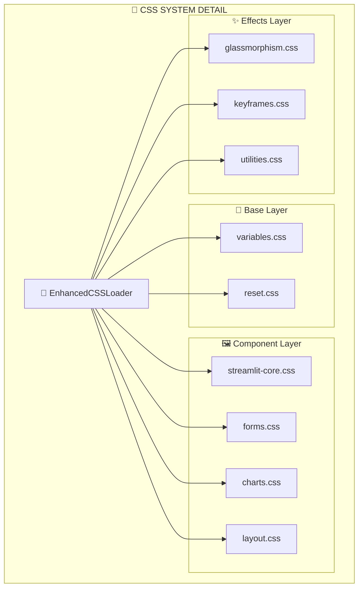
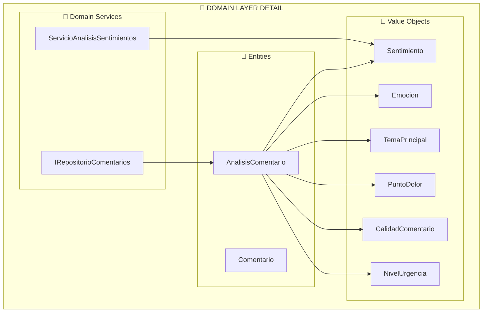
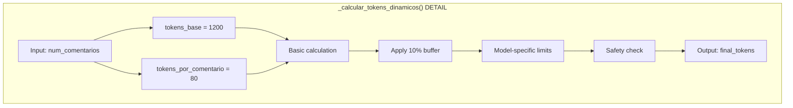
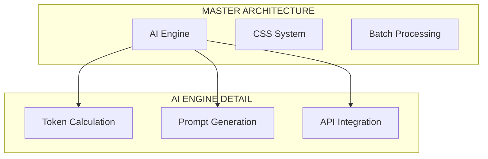

# 🔄 Personal Paraguay - Hierarchical Graph System Design

**System:** Multi-Level Architecture Mapping  
**Approach:** 78 Master Vertices → Sub-Graphs → Granular Components  
**Purpose:** Maximum architectural visibility with controlled granularity  

---

## 🎯 HIERARCHICAL GRAPH CONCEPT

### **Level 0: Master Architecture Graph (78 Vertices)**
The main system overview showing major components and data flows.

### **Level 1: Component Sub-Graphs (Expandable)**  
Each of the 78 vertices can expand to show internal structure.

### **Level 2: Granular Implementation (Function-Level)**
Detailed implementation showing methods, properties, and internal flows.

---

## 🏗️ HIERARCHICAL MAPPING DESIGN

### **🎨 EXAMPLE: CSS SYSTEM HIERARCHY**

#### **Level 0 (Master Graph)**
```mermaid
graph TD
    CSS_LOADER[🎨 EnhancedCSSLoader]
    CSS_SYSTEM[📂 CSS System (15 components)]
    CSS_LOADER --> CSS_SYSTEM
```

#### **Level 1 (CSS Sub-Graph)**


#### **Level 2 (Implementation Detail)**
```mermaid
graph TD
    subgraph "🎨 EnhancedCSSLoader INTERNALS"
        LOAD_CSS[load_css()]
        ENSURE_CSS[ensure_css_loaded()]
        INJECT_PAGE[inject_page_css()]
        PROCESS_IMPORTS[_process_imports()]
        LOAD_FILE[_load_css_file()]
        
        LOAD_CSS --> ENSURE_CSS
        ENSURE_CSS --> INJECT_PAGE
        INJECT_PAGE --> PROCESS_IMPORTS
        PROCESS_IMPORTS --> LOAD_FILE
    end
```

---

## 🧠 SUB-GRAPH EXAMPLES FOR MAJOR VERTICES

### **🤖 AI ENGINE SUB-GRAPH**

#### **Level 1: AnalizadorMaestroIA Components**
```mermaid
graph TD
    subgraph "🤖 AI ENGINE DETAIL"
        AI_MAIN[AnalizadorMaestroIA]
        
        subgraph "🔧 Core Methods"
            AI_ANALYZE[analizar_excel_completo()]
            AI_PROMPT[_generar_prompt_maestro()]
            AI_TOKENS[_calcular_tokens_dinamicos()]
            AI_API[_hacer_llamada_api_maestra()]
            AI_PROCESS[_procesar_respuesta_maestra()]
        end
        
        subgraph "💾 Cache System"
            CACHE_GET[_verificar_cache_valido()]
            CACHE_SET[_guardar_en_cache()]
            CACHE_KEY[_generar_cache_key()]
            CACHE_CLEAN[limpiar_cache()]
        end
        
        subgraph "⚙️ Configuration"
            CONFIG_MODEL[modelo: str]
            CONFIG_TEMP[temperatura: float]
            CONFIG_TOKENS[max_tokens_limit: int]
            CONFIG_CACHE[cache_ttl: int]
        end
        
        AI_MAIN --> AI_ANALYZE
        AI_ANALYZE --> AI_PROMPT
        AI_ANALYZE --> AI_TOKENS
        AI_ANALYZE --> AI_API
        AI_API --> AI_PROCESS
        AI_ANALYZE --> CACHE_GET
        AI_PROCESS --> CACHE_SET
    end
```

### **📊 BATCH PROCESSING SUB-GRAPH**

#### **Level 1: Multi-Batch Processing Components**
```mermaid
graph TD
    subgraph "📦 BATCH PROCESSING DETAIL"
        BATCH_MAIN[_procesar_en_lotes()]
        
        subgraph "🔄 Batch Management"
            BATCH_SPLIT[Split into batches]
            BATCH_LOOP[Process each batch]
            BATCH_PAUSE[Rate limiting (2s)]
            BATCH_COLLECT[Collect results]
        end
        
        subgraph "📈 Result Aggregation"
            AGG_SENT[Aggregate sentiments]
            AGG_THEMES[Combine themes]
            AGG_CONFIDENCE[Calculate avg confidence]
            AGG_STATS[Generate consolidated stats]
        end
        
        BATCH_MAIN --> BATCH_SPLIT
        BATCH_SPLIT --> BATCH_LOOP
        BATCH_LOOP --> BATCH_PAUSE
        BATCH_PAUSE --> BATCH_COLLECT
        BATCH_COLLECT --> AGG_SENT
        BATCH_COLLECT --> AGG_THEMES
        BATCH_COLLECT --> AGG_CONFIDENCE
        BATCH_COLLECT --> AGG_STATS
    end
```

### **🏢 DOMAIN LAYER SUB-GRAPH**

#### **Level 1: Domain Objects Detail**


---

## 🛠️ IMPLEMENTATION APPROACH

### **🔧 Technical Implementation Options**

#### **Option 1: Interactive Documentation System**
```markdown
# Master Graph
→ Click vertex → Expand to sub-graph
→ Click sub-component → Show implementation detail
→ Breadcrumb navigation: Master > CSS System > glassmorphism.css
```

#### **Option 2: Nested Mermaid System**
```markdown
# Hierarchical Documentation Files
├── Master_Graph.md (78 vertices overview)
├── CSS_System_Subgraph.md (15 CSS components detail)
├── AI_Engine_Subgraph.md (AI processing internals)
├── Domain_Layer_Subgraph.md (business logic detail)
└── Infrastructure_Subgraph.md (external services detail)
```

#### **Option 3: Graph Database System**
```yaml
# Graph Database Schema
Master_Vertices:
  - id: "css_loader"
    type: "presentation"
    sub_graph: "css_system"
    
Sub_Graphs:
  css_system:
    vertices:
      - id: "glassmorphism_css"
        type: "stylesheet"
        functions: ["apply_glass_effect", "backdrop_filter"]
```

---

## 📋 PROPOSED SUB-GRAPH STRUCTURE

### **Level 1 Sub-Graphs (15 Major Sub-Graphs)**

1. **🎨 CSS_System_Subgraph** (15 components)
   - Base layer, Components, Effects, Animations, Utils
   
2. **🤖 AI_Engine_Subgraph** (8 methods)
   - Token calculation, Prompt generation, API calls, Response processing
   
3. **📦 Batch_Processing_Subgraph** (6 processes)  
   - Batch splitting, Processing loop, Rate limiting, Result aggregation
   
4. **🏢 Domain_Layer_Subgraph** (14 objects)
   - Entities, Value Objects, Services, Business rules
   
5. **📁 File_Processing_Subgraph** (5 components)
   - Excel reader, Text processor, Validation, Preview
   
6. **💾 Cache_Infrastructure_Subgraph** (4 components)
   - LRU cache, TTL management, SQLite storage, Statistics
   
7. **⚙️ Configuration_Management_Subgraph** (5 sources)
   - Environment variables, Secrets, Defaults, Validation
   
8. **📊 UI_Display_Subgraph** (8 components)
   - Metrics display, Charts, Insights, Critical detection
   
9. **📄 Excel_Export_Subgraph** (3 processes)
   - Data formatting, Workbook generation, Download handling
   
10. **🔧 Dependency_Injection_Subgraph** (6 services)
    - Service factories, Singleton management, Configuration
    
11. **🛡️ Error_Handling_Subgraph** (4 exception types)
    - IA exceptions, File exceptions, Recovery, User feedback
    
12. **🧹 Memory_Management_Subgraph** (3 processes)
    - Session cleanup, Garbage collection, Large file optimization
    
13. **📈 Session_Management_Subgraph** (4 components)
    - State validation, Persistence, Navigation, Cleanup
    
14. **🌐 External_Services_Subgraph** (3 services)
    - OpenAI API, File system, Database connections
    
15. **📚 Documentation_System_Subgraph** (44 files)
    - Architecture docs, Analysis reports, User guides, API docs

---

## 🎯 IMPLEMENTATION RECOMMENDATION

### **Phase 1: Enhanced Documentation Structure**
```markdown
docs/arquitectura/
├── Master_Graph.md                    # 78-vertex overview
├── subgraphs/
│   ├── CSS_System_Detail.md          # 15 CSS components
│   ├── AI_Engine_Detail.md           # 8 AI methods  
│   ├── Batch_Processing_Detail.md    # 6 batch processes
│   ├── Domain_Layer_Detail.md        # 14 domain objects
│   ├── Cache_Infrastructure_Detail.md # 4 cache components
│   └── [11 more detailed sub-graphs]
└── interactive/
    ├── Graph_Navigation.md            # Navigation system
    └── Vertex_Index.md               # Searchable index
```

### **Phase 2: Interactive Navigation**
```markdown
# Each vertex links to its sub-graph
[🎨 CSS_System] → Click → CSS_System_Detail.md
[🤖 AI_Engine] → Click → AI_Engine_Detail.md  
[📦 Batch_Processing] → Click → Batch_Processing_Detail.md
```

### **Phase 3: Graph Database (Advanced)**
```yaml
# Could implement with:
- Neo4j for graph database
- D3.js for interactive visualization  
- REST API for graph queries
- Web interface for exploration
```

---

## 🔍 GRANULARITY LEVELS EXAMPLE

### **🤖 AI Engine Vertex Expansion**

#### **Level 0: Master Graph**
```
[🤖 analizador_maestro_ia.py] → AI Engine
```

#### **Level 1: Component Sub-Graph**  
```
🤖 AnalizadorMaestroIA
├── 🔧 __init__() - Configuration
├── 📊 analizar_excel_completo() - Main analysis
├── ⚖️ _calcular_tokens_dinamicos() - Token management
├── 📝 _generar_prompt_maestro() - Prompt creation
├── 🌐 _hacer_llamada_api_maestra() - OpenAI integration
├── 📋 _procesar_respuesta_maestra() - Response parsing
├── 💾 Cache management methods (4 methods)
└── 🔍 Utility methods (3 methods)
```

#### **Level 2: Method Detail Sub-Graph**


---

## 🎯 PRACTICAL IMPLEMENTATION

### **📚 Documentation Structure**

#### **Master Documentation Hub**
```markdown
docs/arquitectura/
├── 00_Master_Graph.md                # 78-vertex overview  
├── 01_Navigation_System.md           # How to explore sub-graphs
├── 02_Vertex_Index.md               # Searchable component index
├── subgraphs/
│   ├── presentation/
│   │   ├── CSS_System_Subgraph.md   # 15 CSS components
│   │   ├── Pages_Subgraph.md        # 3 Streamlit pages  
│   │   └── Session_Subgraph.md      # 4 session components
│   ├── application/
│   │   ├── UseCase_Subgraph.md      # 2 use cases detail
│   │   ├── DTO_Subgraph.md          # 3 DTOs detail
│   │   └── Interfaces_Subgraph.md   # 3 interfaces detail
│   ├── domain/
│   │   ├── Entities_Subgraph.md     # 2 entities detail
│   │   ├── ValueObjects_Subgraph.md # 7 VOs detail  
│   │   └── Services_Subgraph.md     # Domain services detail
│   ├── infrastructure/
│   │   ├── AI_Engine_Subgraph.md    # AI processing detail
│   │   ├── Cache_Subgraph.md        # Cache system detail
│   │   ├── FileHandling_Subgraph.md # File processing detail
│   │   └── DI_Container_Subgraph.md # Dependency injection detail
│   └── configuration/
│       ├── Environment_Subgraph.md  # Config management detail
│       └── Deployment_Subgraph.md   # Deployment configuration
```

### **🔗 Navigation System**

#### **Cross-Reference Links**
```markdown
# In Master_Graph.md
[🤖 AI Engine] → [View Detail](./subgraphs/infrastructure/AI_Engine_Subgraph.md)
[🎨 CSS System] → [View Detail](./subgraphs/presentation/CSS_System_Subgraph.md)

# In AI_Engine_Subgraph.md
← [Back to Master Graph](../00_Master_Graph.md)
→ [Related: Batch Processing](./Batch_Processing_Subgraph.md)
```

#### **Searchable Index**
```markdown
# Vertex_Index.md
## A
- AnalizadorMaestroIA → infrastructure/AI_Engine_Subgraph.md
- AnalisisCompletoIA → application/DTO_Subgraph.md

## B  
- Batch Processing → infrastructure/Batch_Processing_Subgraph.md

## C
- CSS Loader → presentation/CSS_System_Subgraph.md
- Cache System → infrastructure/Cache_Subgraph.md
```

---

## 🔄 INTERACTIVE FEATURES

### **🎯 Drill-Down Navigation**
```
Master Graph (78 vertices)
    ↓ Click [🤖 AI Engine]
Sub-Graph (8 AI methods)  
    ↓ Click [⚖️ Token Calculation]
Implementation Detail (5 calculation steps)
    ↓ Click [🔍 Model Limits]
Code Detail (model-specific logic)
```

### **🔍 Search & Filter**
```markdown
# Search Interface
Search: "token" → Results:
- 🤖 AI Engine → _calcular_tokens_dinamicos()
- ⚙️ Configuration → OPENAI_MAX_TOKENS
- 📊 Batch Processing → token usage aggregation
```

### **📊 Visual Complexity Management**
```markdown
# Expand/Collapse Controls
- Master View: Show only major vertices (78)
- Detailed View: Show sub-components (300+)  
- Implementation View: Show all methods (400+)
- Custom View: Show selected layers only
```

---

## 🛠️ IMPLEMENTATION TOOLS

### **Option 1: Enhanced Markdown (Recommended)**
```markdown
# Using collapsible sections
<details>
<summary>🤖 AI Engine (Click to expand)</summary>

### AI Processing Methods
- analizar_excel_completo()
- _calcular_tokens_dinamicos()
- _generar_prompt_maestro()
...

</details>
```

### **Option 2: Mermaid with Subgraphs**


### **Option 3: Interactive Web Tool (Advanced)**
```html
<!-- HTML with JavaScript for interactive exploration -->
<div id="graph-container">
  <svg id="main-graph">
    <!-- 78 clickable vertices -->
  </svg>
  <div id="detail-panel">
    <!-- Sub-graph detail on click -->
  </div>
</div>
```

---

## 🎉 BENEFITS OF HIERARCHICAL SYSTEM

### **🎯 For Different Audiences**
- **Executives**: Master graph (high-level overview)
- **Architects**: Level 1 sub-graphs (component detail)  
- **Developers**: Level 2 implementation (method detail)
- **DevOps**: Configuration and deployment sub-graphs

### **📊 Scalable Documentation**
- **Controlled complexity**: Choose level of detail needed
- **Easy navigation**: Drill down from overview to implementation  
- **Comprehensive coverage**: Nothing hidden, everything accessible
- **Maintainable**: Update sub-graphs independently

### **🔍 Enhanced Understanding**
- **Context preservation**: Always know where you are in the system
- **Relationship clarity**: See how components connect at different levels
- **Impact analysis**: Understand change effects across levels

---

## 🚀 NEXT STEPS

1. **Create 15 sub-graph documentation files** for major vertices
2. **Implement navigation system** with cross-references
3. **Add searchable index** for quick component lookup  
4. **Create interactive features** with collapsible sections
5. **Validate completeness** of hierarchical mapping

**This hierarchical system would provide the ultimate architectural documentation with maximum granularity control and exploration capability.**