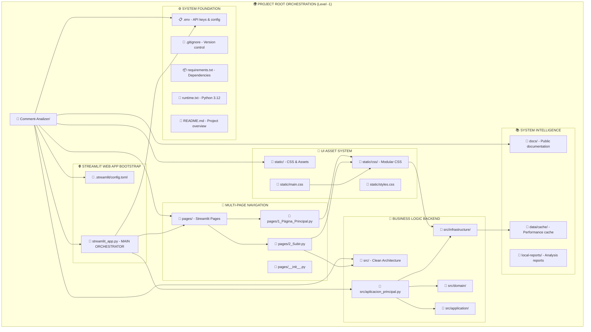
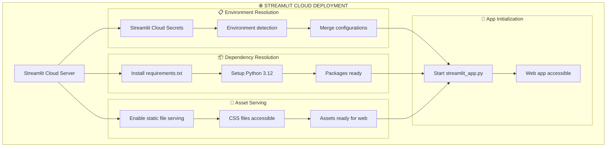
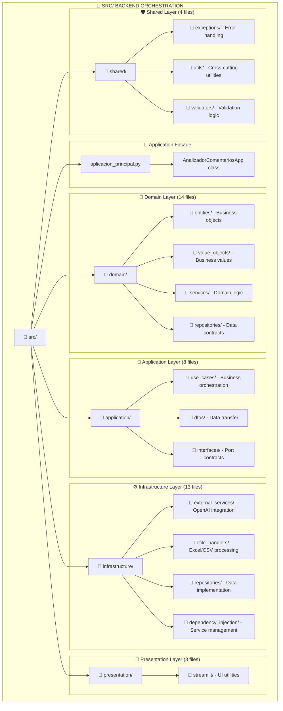

# 🌍 Level -1: Root Orchestration Graph - Web App Bootstrap

**Level:** -1 (Root Folder Orchestration)  
**Scope:** Project root → Web app startup → System integration  
**Purpose:** Map how root-level components orchestrate the entire web application  

---

## 🎯 LEVEL -1 CONCEPT

### **📊 Hierarchical Level Structure**
```
Level -1: ROOT ORCHESTRATION (Project folder → Web app startup)
    ↓
Level  0: MASTER ARCHITECTURE (78 vertices → System components)
    ↓  
Level  1: SUB-GRAPHS (15+ sub-graphs → Component internals)
    ↓
Level  2: IMPLEMENTATION (400+ methods → Code detail)
```

### **🌍 Root-Level Orchestration Scope**
- **How `streamlit_app.py` becomes a web app**
- **How `pages/` directory creates multi-page navigation**
- **How `static/` folder integrates with the UI system**
- **How `src/` provides the business logic backend**
- **How configuration files enable the entire system**

---

## 🎭 ROOT ORCHESTRATION ARCHITECTURE

### **🌍 Complete Root-Level Bootstrap Flow**


---

## 🎭 ROOT-LEVEL ORCHESTRATION DETAILS

### **🌍 1. PROJECT ROOT → WEB APP TRANSFORMATION**

#### **📱 `streamlit_app.py` - THE MAIN ORCHESTRATOR**
```python
"""
ROOT-LEVEL ORCHESTRATION RESPONSIBILITIES:
1. 🔧 System Bootstrap & Configuration Loading
2. 🧠 Business Logic Backend Integration  
3. 📱 Multi-Page Navigation Setup
4. 🎨 CSS System Integration
5. 🌐 Web App Server Preparation
"""

# ORCHESTRATION SEQUENCE:
1. Load environment configuration (.env + secrets)
2. Initialize Clean Architecture backend (src/)
3. Setup multi-page navigation (pages/)
4. Load CSS system (static/)
5. Create web app server ready for user access
```

#### **🔄 Bootstrap Orchestration Flow**
```mermaid
graph TD
    subgraph "📱 STREAMLIT_APP.PY ORCHESTRATION"
        START[🚀 Streamlit Server Start]
        
        subgraph "⚙️ Configuration Bootstrap"
            LOAD_ENV[Load .env variables]
            LOAD_SECRETS[Load Streamlit secrets]
            VALIDATE_OPENAI[Validate OpenAI API key]
            CREATE_CONFIG[Create unified config dict]
        end
        
        subgraph "🧠 Backend Integration"  
            IMPORT_SRC[Import src.aplicacion_principal]
            IMPORT_DI[Import ContenedorDependencias]
            CREATE_CONTAINER[Create DI container]
            INIT_AI_SYSTEM[Initialize AI system]
            VALIDATE_SYSTEM[Validate system readiness]
        end
        
        subgraph "📱 UI System Setup"
            PAGE_CONFIG[Set page configuration]
            THEME_SETUP[Setup theme (dark mode)]
            LOAD_CSS[Load CSS system]
            SETUP_NAVIGATION[Setup page navigation]
        end
        
        subgraph "🌐 Web App Ready"
            SESSION_STATE[Initialize session state]
            NAVIGATION_READY[Navigation system ready]  
            PAGES_ACTIVE[Pages available for routing]
            WEB_APP_LIVE[🎯 Web App Live & Accessible]
        end
        
        START --> LOAD_ENV
        LOAD_ENV --> LOAD_SECRETS
        LOAD_SECRETS --> VALIDATE_OPENAI
        VALIDATE_OPENAI --> CREATE_CONFIG
        CREATE_CONFIG --> IMPORT_SRC
        IMPORT_SRC --> IMPORT_DI
        IMPORT_DI --> CREATE_CONTAINER
        CREATE_CONTAINER --> INIT_AI_SYSTEM
        INIT_AI_SYSTEM --> VALIDATE_SYSTEM
        VALIDATE_SYSTEM --> PAGE_CONFIG
        PAGE_CONFIG --> THEME_SETUP
        THEME_SETUP --> LOAD_CSS
        LOAD_CSS --> SETUP_NAVIGATION
        SETUP_NAVIGATION --> SESSION_STATE
        SESSION_STATE --> NAVIGATION_READY
        NAVIGATION_READY --> PAGES_ACTIVE
        PAGES_ACTIVE --> WEB_APP_LIVE
    end
```

### **🌐 2. STREAMLIT CLOUD DEPLOYMENT INTEGRATION**

#### **🔧 Production Configuration Orchestration**


---

## 📁 ROOT DIRECTORY ORCHESTRATION MAPPING

### **🗂️ Root Folder Structure & Responsibilities**
```
Comment-Analizer/                           # 🌍 PROJECT ROOT
├── .env                                   # 🔑 API keys & environment config
├── .gitignore                             # 🚫 Version control exclusions
├── .streamlit/config.toml                 # ⚙️ Streamlit production config
├── requirements.txt                       # 📦 Python dependencies (32 packages)
├── runtime.txt                           # 🐍 Python 3.12 specification
├── README.md                             # 📖 Project overview & instructions
├── streamlit_app.py                      # 📱 MAIN WEB APP ORCHESTRATOR
│
├── pages/                                # 📱 MULTI-PAGE NAVIGATION SYSTEM
│   ├── __init__.py                       # 📦 Python package marker
│   ├── 1_Página_Principal.py             # 🏠 Landing page & status
│   └── 2_Subir.py                        # 📊 Main workflow interface
│
├── static/                               # 🎨 UI ASSET SYSTEM  
│   ├── main.css                          # 📄 CSS entry point
│   ├── styles.css                        # 📄 Legacy CSS compatibility
│   └── css/                              # 📁 MODULAR CSS ARCHITECTURE
│       ├── base/                         # 🏗️ Foundation (variables, reset)
│       ├── components/                   # 🖼️ UI components (4 files)
│       ├── animations/                   # ✨ Animation system
│       ├── utils/                        # 🔧 Atomic utilities
│       ├── core.css                      # 🔗 Import manager
│       ├── glassmorphism.css             # 💎 Glass effects
│       └── README.md                     # 📚 CSS architecture docs
│
├── src/                                  # 🧠 CLEAN ARCHITECTURE BACKEND
│   ├── aplicacion_principal.py           # 🎯 Application facade
│   ├── domain/                           # 🏢 Business logic (14 files)
│   ├── application/                      # 🧪 Use cases & DTOs (8 files)
│   ├── infrastructure/                   # ⚙️ External services (13 files)
│   ├── presentation/                     # 📱 UI utilities (3 files)
│   └── shared/                           # 🛡️ Cross-cutting (4 files)
│
├── data/cache/                           # 💾 PERFORMANCE OPTIMIZATION
│   └── api_cache.db                      # 🗄️ SQLite cache (20KB)
│
├── docs/                                 # 📚 PUBLIC DOCUMENTATION  
│   ├── arquitectura/                     # 🏗️ Architecture docs (8+ files)
│   ├── analisis/                         # 🔍 Analysis reports (3 files)
│   ├── deployment/                       # 🚀 Deployment guides (3 files)
│   └── guias/                            # 📖 User guides (3 files)
│
└── local-reports/                        # 📊 DEVELOPMENT INTELLIGENCE
    ├── current/                          # 📈 Current analysis
    ├── backup/                           # 💾 Historical reports  
    └── *.md                              # 📋 21 analysis reports
```

---

## 🚀 WEB APP STARTUP ORCHESTRATION

### **🎭 Streamlit Cloud → Live Web App Flow**
```mermaid
graph TD
    subgraph "🌐 STREAMLIT CLOUD DEPLOYMENT ORCHESTRATION"
        CLOUD[☁️ Streamlit Cloud Server]
        
        subgraph "📋 Infrastructure Preparation"
            REPO_CLONE[Clone GitHub repository]
            PYTHON_SETUP[Setup Python 3.12 (runtime.txt)]
            DEPS_INSTALL[Install dependencies (requirements.txt)]
            SECRETS_LOAD[Load Streamlit Cloud secrets]
            ENV_MERGE[Merge environment variables]
        end
        
        subgraph "🎨 Asset Preparation"
            STATIC_MOUNT[Mount static/ directory]
            CSS_VALIDATE[Validate CSS file structure]
            ASSET_SERVE[Enable static file serving (.streamlit/config.toml)]
        end
        
        subgraph "📱 Application Bootstrap"
            STREAMLIT_START[Execute streamlit_app.py]
            CONFIG_LOAD[Load unified configuration]
            AI_INIT[Initialize AI system backend]
            CSS_LOAD[Load CSS cascade system]
            PAGES_SETUP[Setup multi-page navigation]
            SESSION_INIT[Initialize session state]
        end
        
        subgraph "🌍 Web App Live"
            WEB_SERVER[Web server running]
            PAGES_ROUTE[Pages routing active]
            UI_STYLED[CSS styling applied]
            AI_READY[AI system operational]
            WEB_ACCESSIBLE[🎯 https://app-name.streamlit.app]
        end
        
        CLOUD --> REPO_CLONE
        REPO_CLONE --> PYTHON_SETUP
        PYTHON_SETUP --> DEPS_INSTALL
        DEPS_INSTALL --> SECRETS_LOAD
        SECRETS_LOAD --> ENV_MERGE
        ENV_MERGE --> STATIC_MOUNT
        STATIC_MOUNT --> CSS_VALIDATE
        CSS_VALIDATE --> ASSET_SERVE
        ASSET_SERVE --> STREAMLIT_START
        STREAMLIT_START --> CONFIG_LOAD
        CONFIG_LOAD --> AI_INIT
        AI_INIT --> CSS_LOAD
        CSS_LOAD --> PAGES_SETUP
        PAGES_SETUP --> SESSION_INIT
        SESSION_INIT --> WEB_SERVER
        WEB_SERVER --> PAGES_ROUTE
        PAGES_ROUTE --> UI_STYLED
        UI_STYLED --> AI_READY
        AI_READY --> WEB_ACCESSIBLE
    end
```

---

## 📱 STREAMLIT_APP.PY - THE ROOT ORCHESTRATOR

### **🎯 Main Orchestrator Responsibilities**
```python
"""
streamlit_app.py - ROOT LEVEL ORCHESTRATOR

ORCHESTRATION SEQUENCE:
━━━━━━━━━━━━━━━━━━━━━━━━━━━━━━━━━━━━━━━━━━━━━━━━━━━━━━━━━━━━━━━━
1. 🔧 CONFIGURATION ORCHESTRATION
   ├── Load .env file (dotenv)
   ├── Access Streamlit secrets  
   ├── Validate OpenAI API key
   └── Create unified config dict

2. 🧠 BACKEND SYSTEM INTEGRATION
   ├── Import src/ Clean Architecture
   ├── Initialize ContenedorDependencias  
   ├── Setup AI system (AnalizadorMaestroIA)
   └── Validate system readiness

3. 🎨 UI SYSTEM ORCHESTRATION
   ├── Configure Streamlit page settings
   ├── Load CSS system (static/)
   ├── Setup theme and styling
   └── Initialize session state

4. 📱 NAVIGATION SYSTEM SETUP
   ├── Define pages from pages/ directory
   ├── Create navigation object
   ├── Setup sidebar functionality  
   └── Enable page routing

5. 🌍 WEB APP ACTIVATION
   ├── Run selected page
   ├── Render footer
   ├── Handle page navigation
   └── 🎯 LIVE WEB APPLICATION
━━━━━━━━━━━━━━━━━━━━━━━━━━━━━━━━━━━━━━━━━━━━━━━━━━━━━━━━━━━━━━━━
"""
```

### **⚙️ Configuration Orchestration Detail**
```python
# streamlit_app.py configuration orchestration
try:
    # 1. Multi-source configuration loading
    from dotenv import load_dotenv
    load_dotenv()  # Load .env file
    
    # 2. OpenAI API key resolution (env → secrets → fail)
    openai_key = os.getenv('OPENAI_API_KEY') or st.secrets.get('OPENAI_API_KEY', None)
    
    # 3. Unified configuration creation
    config = {
        'openai_api_key': openai_key,
        'openai_modelo': os.getenv('OPENAI_MODEL') or st.secrets.get('OPENAI_MODEL', 'gpt-4'),
        'openai_temperatura': float(os.getenv('OPENAI_TEMPERATURE', '0.0')),
        'openai_max_tokens': int(os.getenv('OPENAI_MAX_TOKENS', '8000')),
        'max_comments': int(os.getenv('MAX_COMMENTS_PER_BATCH', '20')),
        'cache_ttl': int(os.getenv('CACHE_TTL_SECONDS', '3600'))
    }
    
    # 4. Backend system initialization  
    contenedor = ContenedorDependencias(config)
    caso_uso_maestro = contenedor.obtener_caso_uso_maestro()
    
except Exception as e:
    # 5. Fail-fast if critical system components unavailable
    st.error(f"Error inicializando sistema IA: {str(e)}")
    st.stop()  # Halt web app startup
```

---

## 📁 PAGES/ DIRECTORY - NAVIGATION ORCHESTRATION

### **📱 Multi-Page System Architecture**
```mermaid
graph TD
    subgraph "📱 PAGES DIRECTORY ORCHESTRATION"
        PAGES_DIR[📁 pages/]
        
        subgraph "📄 Page Definitions"  
            PAGE_INIT[__init__.py - Package marker]
            PAGE_MAIN[1_Página_Principal.py - Landing]
            PAGE_UPLOAD[2_Subir.py - Main workflow]
        end
        
        subgraph "🎭 Streamlit Navigation System"
            NAV_SETUP[st.navigation() setup]
            NAV_SIDEBAR[Sidebar position]
            NAV_ORDER[Page order control]
        end
        
        subgraph "🎨 Page-Specific CSS Integration"
            CSS_MAIN[Main page CSS injection]
            CSS_UPLOAD[Upload page CSS injection]  
            CSS_ENHANCED[Enhanced CSS loader per page]
        end
        
        subgraph "🧠 Backend Integration per Page"
            MAIN_STATUS[Status display logic]
            UPLOAD_LOGIC[Analysis workflow logic]
            BACKEND_CALLS[src/ system integration]
        end
        
        PAGES_DIR --> PAGE_INIT
        PAGES_DIR --> PAGE_MAIN  
        PAGES_DIR --> PAGE_UPLOAD
        PAGE_MAIN --> NAV_SETUP
        PAGE_UPLOAD --> NAV_SETUP
        NAV_SETUP --> NAV_SIDEBAR
        PAGE_MAIN --> CSS_MAIN
        PAGE_UPLOAD --> CSS_UPLOAD
        CSS_MAIN --> CSS_ENHANCED
        CSS_UPLOAD --> CSS_ENHANCED
        PAGE_MAIN --> MAIN_STATUS
        PAGE_UPLOAD --> UPLOAD_LOGIC
        UPLOAD_LOGIC --> BACKEND_CALLS
    end
```

### **📊 Page Orchestration Details**

#### **🏠 `1_Página_Principal.py` - Landing Page Orchestration**
```python
"""
LANDING PAGE RESPONSIBILITIES:
1. 🎨 Load enhanced CSS for main page
2. 📊 Display system status and metrics  
3. 💡 Show AI system readiness
4. 📈 Display version and architecture info
5. 🔗 Provide navigation hints to upload page
"""

# Page-specific orchestration:
from src.presentation.streamlit.enhanced_css_loader import ensure_css_loaded, inject_page_css
ensure_css_loaded()           # Load full CSS cascade
inject_page_css('main')       # Add main page specific styles
```

#### **📊 `2_Subir.py` - Main Workflow Orchestration**
```python
"""
UPLOAD PAGE RESPONSIBILITIES:
1. 🎨 Load enhanced CSS with glassmorphism
2. 📁 Handle file upload and validation
3. 📊 Generate file preview with pandas  
4. 🤖 Orchestrate AI analysis workflow
5. 📈 Display results with professional styling
6. 📄 Generate and serve Excel export
"""

# Complex workflow orchestration:
def _run_analysis(uploaded_file, analysis_type):
    # 1. Session validation
    from src.presentation.streamlit.session_validator import get_caso_uso_maestro
    
    # 2. Backend integration
    caso_uso = get_caso_uso_maestro()
    
    # 3. Analysis execution  
    comando = ComandoAnalisisExcelMaestro(...)
    resultado = caso_uso.ejecutar(comando)
    
    # 4. Results storage
    st.session_state.analysis_results = resultado
```

---

## 🎨 STATIC/ FOLDER - ASSET ORCHESTRATION

### **📂 Static Asset Integration Flow**
```mermaid
graph TD
    subgraph "🎨 STATIC FOLDER ORCHESTRATION"
        STATIC_ROOT[📁 static/]
        
        subgraph "📄 Root CSS Files"
            STATIC_MAIN[main.css - Entry point]
            STATIC_STYLES[styles.css - Legacy compatibility]
        end
        
        subgraph "📁 Modular CSS Directory"
            CSS_DIR[📁 static/css/]
            CSS_BASE[📁 base/ - Foundation (2 files)]
            CSS_COMPONENTS[📁 components/ - UI (4 files)]  
            CSS_ANIMATIONS[📁 animations/ - Effects (1 file)]
            CSS_UTILS[📁 utils/ - Utilities (1 file)]
            CSS_GLASS[glassmorphism.css - Glass effects]
            CSS_CORE[core.css - Import fallback]
            CSS_README[README.md - Architecture docs]
        end
        
        subgraph "🌐 Streamlit Integration"
            ENABLE_STATIC[.streamlit/config.toml - enableStaticServing = true]
            CSS_LOADER[src/presentation/streamlit/enhanced_css_loader.py]
            CSS_INJECTION[st.markdown() CSS injection]
        end
        
        subgraph "📱 Page Integration"
            PAGE_CSS[inject_page_css() per page]
            GLASS_EFFECTS[Glassmorphism application]
            RESPONSIVE[Responsive design application]
        end
        
        STATIC_ROOT --> STATIC_MAIN
        STATIC_ROOT --> STATIC_STYLES
        STATIC_ROOT --> CSS_DIR
        CSS_DIR --> CSS_BASE
        CSS_DIR --> CSS_COMPONENTS
        CSS_DIR --> CSS_ANIMATIONS
        CSS_DIR --> CSS_UTILS
        CSS_DIR --> CSS_GLASS
        CSS_DIR --> CSS_CORE
        CSS_DIR --> CSS_README
        
        ENABLE_STATIC --> CSS_LOADER
        CSS_LOADER --> CSS_INJECTION
        CSS_INJECTION --> PAGE_CSS
        PAGE_CSS --> GLASS_EFFECTS
        GLASS_EFFECTS --> RESPONSIVE
        
        CSS_LOADER --> CSS_DIR
    end
```

### **🔧 CSS System Integration Details**
```python
"""
STATIC FOLDER ORCHESTRATION:

1. 📄 .streamlit/config.toml enables static file serving:
   [server]
   enableStaticServing = true

2. 🎨 enhanced_css_loader.py orchestrates CSS cascade:
   ├── Load static/css/base/variables.css (design tokens)
   ├── Load static/css/base/reset.css (CSS reset)
   ├── Load static/css/components/*.css (UI components)
   ├── Load static/css/glassmorphism.css (glass effects)  
   ├── Load static/css/animations/keyframes.css (animations)
   ├── Load static/css/utils/utilities.css (atomic utilities)
   ├── Load static/main.css (main entry point)
   └── Load static/styles.css (legacy compatibility)

3. 📱 Each page calls inject_page_css() for page-specific styling

4. 💎 Glassmorphism effects are applied to Streamlit components
"""
```

---

## 🧠 SRC/ BACKEND INTEGRATION

### **🏗️ Clean Architecture Backend Orchestration**


---

## 🔄 ROOT-LEVEL DATA FLOW ORCHESTRATION

### **🌍 Complete System Integration Flow**

```mermaid
graph TD
    subgraph "🌍 ROOT-LEVEL SYSTEM ORCHESTRATION"
        USER[👤 User accesses web app]
        
        subgraph "🌐 Server Infrastructure"  
            STREAMLIT_SERVER[Streamlit Cloud Server]
            CONFIG_RESOLUTION[Configuration resolution]
            STATIC_SERVING[Static file serving]
        end
        
        subgraph "📱 Web App Entry"
            STREAMLIT_APP[streamlit_app.py execution]
            ENV_LOAD[Environment loading]
            BACKEND_INIT[Backend initialization]
            UI_SETUP[UI system setup]
        end
        
        subgraph "🎨 Asset Loading"
            CSS_DISCOVERY[CSS file discovery]
            CSS_CASCADE[CSS cascade loading]
            GLASS_ACTIVATION[Glassmorphism activation]
            THEME_APPLICATION[Theme application]
        end
        
        subgraph "📱 Page System Activation"
            NAV_CREATION[Navigation creation]
            PAGE_ROUTING[Page routing setup]
            SESSION_READY[Session state ready]
            UI_INTERACTIVE[UI interactive & responsive]
        end
        
        subgraph "🧠 Backend Ready"
            AI_VALIDATED[AI system validated]
            CACHE_READY[Cache system ready]  
            REPOS_READY[Repositories ready]
            SERVICES_READY[Services ready]
        end
        
        subgraph "🎯 Live Web Application"
            MAIN_PAGE[Landing page accessible]
            UPLOAD_PAGE[Upload page accessible]  
            AI_ANALYSIS[AI analysis functional]
            EXPORT_READY[Excel export functional]
            COMPLETE_SYSTEM[🌟 Complete system operational]
        end
        
        USER --> STREAMLIT_SERVER
        STREAMLIT_SERVER --> CONFIG_RESOLUTION
        STREAMLIT_SERVER --> STATIC_SERVING
        CONFIG_RESOLUTION --> STREAMLIT_APP
        STREAMLIT_APP --> ENV_LOAD
        STREAMLIT_APP --> BACKEND_INIT
        STREAMLIT_APP --> UI_SETUP
        STATIC_SERVING --> CSS_DISCOVERY
        UI_SETUP --> CSS_CASCADE
        CSS_CASCADE --> GLASS_ACTIVATION
        GLASS_ACTIVATION --> THEME_APPLICATION
        THEME_APPLICATION --> NAV_CREATION
        NAV_CREATION --> PAGE_ROUTING
        PAGE_ROUTING --> SESSION_READY
        SESSION_READY --> UI_INTERACTIVE
        BACKEND_INIT --> AI_VALIDATED
        AI_VALIDATED --> CACHE_READY
        CACHE_READY --> REPOS_READY
        REPOS_READY --> SERVICES_READY
        SERVICES_READY --> MAIN_PAGE
        UI_INTERACTIVE --> UPLOAD_PAGE
        MAIN_PAGE --> AI_ANALYSIS
        UPLOAD_PAGE --> AI_ANALYSIS
        AI_ANALYSIS --> EXPORT_READY
        EXPORT_READY --> COMPLETE_SYSTEM
    end
```


---

## 📋 ROOT-LEVEL ORCHESTRATION VERTICES

### **🌍 Level -1 Vertex Inventory (10 Root Orchestration Vertices)**

1. **🌐 Streamlit Cloud Server** - Cloud hosting orchestration
2. **📁 Project Root Directory** - File system organization  
3. **📱 streamlit_app.py** - Main web app orchestrator
4. **📁 pages/ Directory** - Multi-page navigation system
5. **🎨 static/ Directory** - Asset serving system  
6. **🧠 src/ Directory** - Clean Architecture backend
7. **💾 data/cache/ Directory** - Performance optimization storage
8. **📚 docs/ Directory** - Public documentation system
9. **📊 local-reports/ Directory** - Development intelligence
10. **⚙️ Configuration Resolution System** - Multi-source config orchestration

### **🔗 Root-Level Dependencies**
```
Streamlit Cloud Server
├── Clones: GitHub Repository
├── Reads: runtime.txt (Python 3.12)
├── Installs: requirements.txt (32 dependencies)
├── Loads: Streamlit Cloud secrets
├── Serves: static/ directory assets
├── Executes: streamlit_app.py
└── Enables: Multi-page navigation

streamlit_app.py
├── Orchestrates: Configuration loading (.env + secrets)
├── Integrates: src/ Clean Architecture backend
├── Activates: pages/ navigation system
├── Loads: static/ CSS cascade
├── Initializes: Session state management
└── Creates: Live web application
```

---

## 🎯 LEVEL -1 TO LEVEL 0 TRANSITION

### **🔄 How Root Orchestration Connects to Master Architecture**
```mermaid
graph TD
    subgraph "🌍 LEVEL -1: ROOT ORCHESTRATION"
        ROOT_ORCH[Root Orchestrator]
        STREAMLIT_APP[streamlit_app.py]
        PAGES_SYS[pages/ system]
        STATIC_SYS[static/ system]
        SRC_SYS[src/ backend]
    end
    
    subgraph "📊 LEVEL 0: MASTER ARCHITECTURE (78 vertices)"
        CONFIG_LAYER[Configuration Layer (5)]
        PRES_LAYER[Presentation Layer (25)]
        APP_LAYER[Application Layer (10)]
        DOMAIN_LAYER[Domain Layer (14)]
        INFRA_LAYER[Infrastructure Layer (18)]
        SHARED_LAYER[Shared Layer (6)]
    end
    
    ROOT_ORCH --> CONFIG_LAYER
    STREAMLIT_APP --> PRES_LAYER
    PAGES_SYS --> PRES_LAYER
    STATIC_SYS --> PRES_LAYER
    SRC_SYS --> APP_LAYER
    SRC_SYS --> DOMAIN_LAYER
    SRC_SYS --> INFRA_LAYER
    SRC_SYS --> SHARED_LAYER
```

---

## 🎮 LEVEL -1 NAVIGATION INTERFACE

### **🗺️ Root Explorer Interface**
```markdown
# 🌍 LEVEL -1: ROOT ORCHESTRATION EXPLORER

Welcome to the **ROOT LEVEL** system orchestration view. This shows how your project folder becomes a live web application.

## 🚀 WEB APP BOOTSTRAP SEQUENCE

### 1. 🌐 CLOUD INFRASTRUCTURE PREPARATION
┌─────────────────────────────────────────┐
│ [☁️ Streamlit Cloud] → Server setup    │ ← Hosting platform
│ [📦 Dependencies] → Package installation│ ← requirements.txt
│ [🐍 Runtime] → Python 3.12 setup      │ ← runtime.txt  
│ [🔒 Secrets] → API key loading         │ ← Cloud secrets
└─────────────────────────────────────────┘

### 2. 📱 WEB APP ORCHESTRATION  
┌─────────────────────────────────────────┐
│ [📱 streamlit_app.py] → Main orchestrator│ ← **THE ROOT CONDUCTOR**
│   ├── 🔧 Load configuration (.env + secrets)
│   ├── 🧠 Initialize backend (src/ system)  
│   ├── 🎨 Setup CSS system (static/ assets)
│   ├── 📱 Create navigation (pages/ routing)
│   └── 🌐 Launch web app (user accessible)
└─────────────────────────────────────────┘

### 3. 🎨 ASSET SYSTEM ACTIVATION
┌─────────────────────────────────────────┐
│ [📁 static/] → Asset serving system     │ ← UI assets
│   ├── 📄 main.css → Main CSS entry
│   ├── 📁 css/ → Modular CSS architecture (15 files)
│   ├── 💎 glassmorphism.css → Glass effects  
│   └── 📚 CSS documentation → Architecture guide
└─────────────────────────────────────────┘

### 4. 📱 NAVIGATION SYSTEM SETUP
┌─────────────────────────────────────────┐
│ [📁 pages/] → Multi-page system         │ ← Page routing
│   ├── 🏠 1_Página_Principal.py → Landing page
│   ├── 📊 2_Subir.py → Main workflow interface
│   └── 🔗 Navigation integration → Seamless routing
└─────────────────────────────────────────┘

### 5. 🧠 BACKEND INTEGRATION  
┌─────────────────────────────────────────┐
│ [📁 src/] → Clean Architecture backend  │ ← Business logic
│   ├── 🏢 Domain layer (14 components)
│   ├── 🧪 Application layer (10 components)
│   ├── ⚙️ Infrastructure layer (18 components)
│   └── 🎯 Complete system ready for analysis
└─────────────────────────────────────────┘

## 🔗 EXPLORE DEEPER
- [📊 View Level 0: Master Architecture](./Pipeline_Flow_Diagram.md) - 78 system vertices
- [🎮 Interactive Explorer](./Interactive_Graph_Explorer.md) - Advanced navigation
- [🗂️ Directory Structure](../estructura-archivos-src-new.md) - Detailed file organization
```

---

## 🎯 ROOT ORCHESTRATION BENEFITS

### **🌍 System Understanding**
- **Complete context**: How folder structure becomes live web app
- **Startup sequence**: Configuration → Backend → UI → Navigation → Live app
- **Integration points**: How root components connect to system layers
- **Deployment flow**: Local development → Cloud deployment → Live system

### **🔧 Development Insights**  
- **Bootstrap debugging**: Understand startup failures
- **Asset integration**: How CSS system connects to UI
- **Configuration flow**: Multi-source config resolution
- **Page routing**: How Streamlit navigation works

### **🚀 Operational Understanding**
- **Deployment process**: What happens during Streamlit Cloud deployment
- **Asset serving**: How static files reach the browser
- **System dependencies**: How root files enable functionality
- **Environment management**: How configuration cascades through system

---

## 📋 IMPLEMENTATION STATUS

### **✅ Level -1 Documentation Created**
- Root orchestration architecture designed
- Bootstrap sequence documented  
- Asset integration mapped
- Navigation system explained
- Backend integration detailed

### **🔄 Integration with Existing Levels**
- Level -1 → Level 0 transition mapped
- Root vertices connect to master architecture
- Progressive disclosure maintained
- Cross-reference system extended

---

**Level -1 provides the ultimate system context - showing how your project folder orchestrates into a sophisticated live web application with enterprise-grade architecture.**