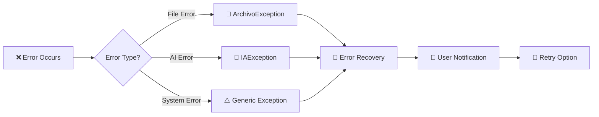

# 🔄 Personal Paraguay - Pipeline Flow Diagram

## Complete Data Flow Visualization

```mermaid
graph TD
    %% CONFIGURATION LAYER (DISCOVERED - NEW)
    ENV[📋 .env] -->|Load| CONFIG[⚙️ Multi-Source Config Manager]
    TOML[📄 .streamlit/config.toml] -->|Production Settings| CONFIG
    REQ[📦 requirements.txt] -->|Dependencies| CONFIG
    RUNTIME[🐍 runtime.txt] -->|Python 3.12| CONFIG
    CONFIG -->|Configure| A[📱 streamlit_app.py]
    
    %% Entry Point with Enhanced Initialization
    A -->|Bootstrap| B[🔧 ContenedorDependencias]
    A -->|Load Config| C[⚙️ Environment Variables + Secrets]
    C -->|OpenAI Key + Params| D[🤖 AI System Init]
    D -->|Ready| E[📄 pages/2_Subir.py]
    
    %% CSS SYSTEM INTEGRATION (DISCOVERED - MAJOR NEW VERTEX)
    E -->|Initialize UI| CSS_LOADER[🎨 EnhancedCSSLoader]
    CSS_LOADER -->|Load Cascade| CSS_BASE[📄 base/variables.css + reset.css]
    CSS_LOADER -->|Load Components| CSS_COMP[🖼️ components/streamlit-core.css + forms.css + charts.css + layout.css]
    CSS_LOADER -->|Load Core| CSS_CORE[🔧 core.css - fallback & imports]
    CSS_LOADER -->|Load Effects| CSS_GLASS[💎 css/glassmorphism.css]
    CSS_LOADER -->|Load Docs| CSS_DOCS[📚 css/README.md - Architecture docs]
    CSS_LOADER -->|Load Animations| CSS_ANIM[✨ animations/keyframes.css]
    CSS_LOADER -->|Load Utils| CSS_UTILS[🔧 utils/utilities.css]
    CSS_GLASS -->|Apply Effects| UI_STYLED[🎨 Professional Glassmorphism UI]
    
    %% File Upload Flow with Styled UI
    UI_STYLED -->|Enhanced Upload| F[📂 File Validation + Preview]
    F -->|Pandas Preview| G[📊 DataFrame with Styled Display]
    G -->|Auto-Detect| H[💬 Comment Column Detection]
    H -->|Validation Complete| I[🔘 AI Analysis Button]
    
    %% Analysis Trigger
    I -->|Click| J[🔍 _run_analysis()]
    J -->|Validate| K[✅ session_validator]
    K -->|Get Use Case| L[🎯 get_caso_uso_maestro()]
    
    %% Main Use Case
    L -->|Execute| M[🚀 AnalizarExcelMaestroCasoUso]
    M -->|Create Command| N[📋 ComandoAnalisisExcelMaestro]
    N -->|Read File| O[📖 lector_archivos_excel]
    
    %% Text Processing
    O -->|Raw Data| P[📝 procesador_texto_basico]
    P -->|Clean Text| Q[🔢 Comment Count Check]
    
    %% Batch Decision (OPTIMIZED for 8K token limit)
    Q -->|≤20 Comments| R[📦 Single Batch]
    Q -->|>20 Comments| S[📦 Multi-Batch Processing]
    
    %% Single Batch Flow
    R -->|Direct| T[🤖 analizador_maestro_ia]
    
    %% Multi-Batch Flow  
    S -->|Split| U[🔄 _procesar_en_lotes()]
    U -->|Create Batches| V[📊 50-60 Lotes × 20 comentarios]
    V -->|For Each Batch| W[🤖 analizador_maestro_ia]
    W -->|Pause 2s| X[⏳ Rate Limiting]
    X -->|Next Batch| V
    W -->|Results| Y[📈 _agregar_resultados_lotes()]
    
    %% AI Processing Core
    T -->|Generate| Z[📝 _generar_prompt_maestro()]
    W -->|Generate| Z
    Z -->|Calculate| AA[⚖️ _calcular_tokens_dinamicos()]
    AA -->|Check Limits| AB{🔍 Token Limit OK?}
    AB -->|Yes| AC[🌐 OpenAI API Call]
    AB -->|No| AD[❌ IAException]
    
    %% CACHE SYSTEM INTEGRATION (DISCOVERED - MAJOR NEW VERTEX)
    AC -.->|Check Cache| CACHE_LRU[💾 LRU Cache Manager]
    CACHE_LRU -.->|Cache Hit| AG[📊 Cached AnalisisCompletoIA]
    CACHE_LRU -.->|Cache Miss| AC
    CACHE_LRU -.->|Persist| CACHE_DB[🗄️ data/cache/api_cache.db]
    CACHE_LRU -.->|TTL Expire| CACHE_CLEANUP[🧹 Cache Cleanup]
    
    %% AI Response Processing
    AC -->|JSON Response| AE[📋 _procesar_respuesta_maestra()]
    AE -->|Parse Compact| AF[🔍 Abbreviated JSON Validation]
    AF -->|Valid| AG[📊 AnalisisCompletoIA]
    AF -->|Invalid| AH[❌ JSON Truncation Error]
    
    %% CACHE STORAGE (NEW)
    AG -->|Store Result| CACHE_LRU
    
    %% Result Consolidation
    AG -->|From Single| AI[🎯 Single Result]
    Y -->|From Multi| AI
    AI -->|Map to Domain| AJ[🏢 _mapear_a_entidades_dominio()]
    
    %% Domain Object Creation
    AJ -->|Create| AK[💭 Sentimiento Objects]
    AJ -->|Create| AL[😊 Emocion Objects]
    AJ -->|Create| AM[🏷️ TemaPrincipal Objects]
    AJ -->|Create| AN[⚠️ PuntoDolor Objects]
    AJ -->|Create| AO[📈 AnalisisComentario Objects]
    
    %% Data Persistence
    AO -->|Save| AP[💾 repositorio_comentarios_memoria]
    AP -->|Store| AQ[📁 In-Memory Storage]
    AQ -->|Return| AR[✅ ResultadoAnalisisMaestro]
    
    %% MEMORY MANAGEMENT (DISCOVERED - NEW VERTEX)
    AQ -->|Memory Check| MEM_MGR[🧹 Memory Manager]
    MEM_MGR -->|Cleanup Sessions| MEM_CLEAN[♻️ Session Cleanup]
    MEM_MGR -->|Garbage Collection| MEM_GC[🗑️ GC Optimization]
    
    %% UI DISPLAY WITH PROFESSIONAL STYLING
    AR -->|Display with Glass Effects| AS[📊 Glassmorphism Metrics]
    CSS_GLASS -.->|Style| AS
    AS -->|Styled Charts| AT[📈 Professional Charts with CSS]
    CSS_COMP -.->|Style| AT  
    AT -->|Enhanced Insights| AU[💡 AI Insights with Animation]
    CSS_ANIM -.->|Animate| AU
    AU -->|Critical Detection| AV[🚨 Critical Comments with Glass Cards]
    
    %% Export Generation
    AV -->|Export| AW[📄 _create_professional_excel()]
    AW -->|Generate| AX[📊 Excel Workbook]
    AX -->|Multiple Sheets| AY[📋 Detailed Analysis]
    AY -->|Download| AZ[⬇️ Download Button]
    
    %% Error Handling
    AD -.->|Handle| BA[❌ Error Display]
    AH -.->|Handle| BA
    
    %% Cache System
    AC -.->|Cache| BB[💾 LRU Cache + TTL]
    BB -.->|Hit| AG
    
    %% Configuration Flow
    C -.->|Config| CC[⚙️ MAX_COMMENTS_PER_BATCH]
    C -.->|Config| CD[⚙️ OPENAI_MODEL]
    C -.->|Config| CE[⚙️ OPENAI_MAX_TOKENS]
    
    %% Style Classes (EXPANDED for NEW VERTICES)
    classDef config fill:#e3f2fd
    classDef css fill:#fce4ec  
    classDef cache fill:#f3e5f5
    classDef memory fill:#e8f5e8
    classDef entry fill:#e1f5fe
    classDef processing fill:#f3e5f5
    classDef ai fill:#fff3e0
    classDef domain fill:#e8f5e8
    classDef storage fill:#fce4ec
    classDef ui fill:#f1f8e9
    classDef error fill:#ffebee
    
    %% APPLY CLASSES TO NEW VERTICES (COMPLETE)
    class ENV,TOML,REQ,RUNTIME,CONFIG config
    class CSS_LOADER,CSS_BASE,CSS_COMP,CSS_CORE,CSS_GLASS,CSS_DOCS,CSS_ANIM,CSS_UTILS,UI_STYLED css
    class CACHE_LRU,CACHE_DB,CACHE_CLEANUP cache
    class MEM_MGR,MEM_CLEAN,MEM_GC memory
    class A,E entry
    class M,N,O,P processing
    class T,W,Z,AA,AC,AE ai
    class AJ,AK,AL,AM,AN,AO domain  
    class AP,AQ storage
    class AS,AT,AU,AV,AW,AX,AY,AZ ui
    class AD,AH,BA error
```

---

## 🔍 Flow Explanation

### 1. **System Bootstrap** (streamlit_app.py → ContenedorDependencias)
- Load environment variables and secrets
- Initialize OpenAI API key validation
- Setup dependency injection container
- Configure AI system components

### 2. **File Upload & Validation** (pages/2_Subir.py)
- Accept Excel/CSV files up to 5MB
- Generate pandas DataFrame preview
- Auto-detect comment columns
- Validate file structure

### 3. **Analysis Decision Point** (AnalizarExcelMaestroCasoUso) - OPTIMIZED
- **≤20 comments**: Direct single-batch processing
- **>20 comments**: Multi-batch processing with consolidation
- **Rate limiting**: 2-second pause between batches
- **Token optimization**: Ultra-compact prompts and responses

### 4. **AI Processing Engine** (analizador_maestro_ia.py) - OPTIMIZED
- **Ultra-compact token calculation**: 1200 base + 80 per comment + 10% buffer
- **Minimalist prompt generation**: Abbreviated JSON fields and concise instructions  
- **Strict limit enforcement**: Respects 8K token configuration limit
- **Model-specific handling**: (gpt-4o-mini: 16K, gpt-4: 128K tokens)
- **Built-in caching**: LRU + TTL for performance

### 5. **Domain Mapping** (_mapear_a_entidades_dominio)
- Convert AI responses to domain objects
- Create rich value objects (Sentimiento, Emocion, etc.)
- Apply business rules and validations

### 6. **Results Display & Export** (UI Layer)
- Real-time metrics and visualizations
- AI insights and recommendations
- Critical comment detection
- Professional Excel export with multiple sheets

---

## ⚡ Performance Characteristics

### Processing Times (OPTIMIZED)
- **20 comments**: ~10 seconds
- **400 comments**: ~3.5 minutes  
- **1000 comments**: ~8.5 minutes
- **1200 comments**: ~10 minutes

### Resource Usage (OPTIMIZED)
- **Memory**: ~30MB per batch
- **API Calls**: 1 per 20 comments
- **Token Usage**: ~2,960 per batch (safe under 8K limit)

### Bottlenecks
- OpenAI API rate limits (TPM)
- JSON response parsing
- Large file memory usage

---

## 🛡️ Error Handling Flow



---

This flow diagram represents the complete end-to-end pipeline for the Personal Paraguay AI Comment Analyzer system.