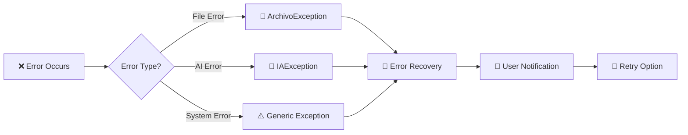

# 🔄 Personal Paraguay - Pipeline Flow Diagram

## Complete Data Flow Visualization

```mermaid
graph TD
    %% Entry Point
    A[📱 streamlit_app.py] -->|Bootstrap| B[🔧 ContenedorDependencias]
    A -->|Load Config| C[⚙️ Environment Variables]
    C -->|OpenAI Key| D[🤖 AI System Init]
    D -->|Ready| E[📄 pages/2_Subir.py]
    
    %% File Upload Flow
    E -->|Upload| F[📂 File Validation]
    F -->|Preview| G[📊 Pandas DataFrame]
    G -->|Detect Columns| H[💬 Comment Detection]
    H -->|Valid| I[🔘 Analysis Button]
    
    %% Analysis Trigger
    I -->|Click| J[🔍 _run_analysis()]
    J -->|Validate| K[✅ session_validator]
    K -->|Get Use Case| L[🎯 get_caso_uso_maestro()]
    
    %% Main Use Case
    L -->|Execute| M[🚀 AnalizarExcelMaestroCasoUso]
    M -->|Create Command| N[📋 ComandoAnalisisExcelMaestro]
    N -->|Read File| O[📖 lector_archivos_excel]
    
    %% Text Processing
    O -->|Raw Data| P[📝 procesador_texto_basico]
    P -->|Clean Text| Q[🔢 Comment Count Check]
    
    %% Batch Decision
    Q -->|≤40 Comments| R[📦 Single Batch]
    Q -->|>40 Comments| S[📦 Multi-Batch Processing]
    
    %% Single Batch Flow
    R -->|Direct| T[🤖 analizador_maestro_ia]
    
    %% Multi-Batch Flow  
    S -->|Split| U[🔄 _procesar_en_lotes()]
    U -->|Create Batches| V[📊 25-30 Lotes]
    V -->|For Each Batch| W[🤖 analizador_maestro_ia]
    W -->|Pause 2s| X[⏳ Rate Limiting]
    X -->|Next Batch| V
    W -->|Results| Y[📈 _agregar_resultados_lotes()]
    
    %% AI Processing Core
    T -->|Generate| Z[📝 _generar_prompt_maestro()]
    W -->|Generate| Z
    Z -->|Calculate| AA[⚖️ _calcular_tokens_dinamicos()]
    AA -->|Check Limits| AB{🔍 Token Limit OK?}
    AB -->|Yes| AC[🌐 OpenAI API Call]
    AB -->|No| AD[❌ IAException]
    
    %% AI Response Processing
    AC -->|JSON Response| AE[📋 _procesar_respuesta_maestra()]
    AE -->|Parse| AF[🔍 JSON Validation]
    AF -->|Valid| AG[📊 AnalisisCompletoIA]
    AF -->|Invalid| AH[❌ JSON Error]
    
    %% Result Consolidation
    AG -->|From Single| AI[🎯 Single Result]
    Y -->|From Multi| AI
    AI -->|Map to Domain| AJ[🏢 _mapear_a_entidades_dominio()]
    
    %% Domain Object Creation
    AJ -->|Create| AK[💭 Sentimiento Objects]
    AJ -->|Create| AL[😊 Emocion Objects]
    AJ -->|Create| AM[🏷️ TemaPrincipal Objects]
    AJ -->|Create| AN[⚠️ PuntoDolor Objects]
    AJ -->|Create| AO[📈 AnalisisComentario Objects]
    
    %% Data Persistence
    AO -->|Save| AP[💾 repositorio_comentarios_memoria]
    AP -->|Store| AQ[📁 In-Memory Storage]
    AQ -->|Return| AR[✅ ResultadoAnalisisMaestro]
    
    %% UI Display
    AR -->|Display| AS[📊 Metrics Display]
    AS -->|Show| AT[📈 Streamlit Charts]
    AT -->|Render| AU[💡 AI Insights]
    AU -->|Detect| AV[🚨 Critical Comments]
    
    %% Export Generation
    AV -->|Export| AW[📄 _create_professional_excel()]
    AW -->|Generate| AX[📊 Excel Workbook]
    AX -->|Multiple Sheets| AY[📋 Detailed Analysis]
    AY -->|Download| AZ[⬇️ Download Button]
    
    %% Error Handling
    AD -.->|Handle| BA[❌ Error Display]
    AH -.->|Handle| BA
    
    %% Cache System
    AC -.->|Cache| BB[💾 LRU Cache + TTL]
    BB -.->|Hit| AG
    
    %% Configuration Flow
    C -.->|Config| CC[⚙️ MAX_COMMENTS_PER_BATCH]
    C -.->|Config| CD[⚙️ OPENAI_MODEL]
    C -.->|Config| CE[⚙️ OPENAI_MAX_TOKENS]
    
    %% Style Classes
    classDef entry fill:#e1f5fe
    classDef processing fill:#f3e5f5
    classDef ai fill:#fff3e0
    classDef domain fill:#e8f5e8
    classDef storage fill:#fce4ec
    classDef ui fill:#f1f8e9
    classDef error fill:#ffebee
    
    class A,E entry
    class M,N,O,P processing
    class T,W,Z,AA,AC,AE ai
    class AJ,AK,AL,AM,AN,AO domain  
    class AP,AQ storage
    class AS,AT,AU,AV,AW,AX,AY,AZ ui
    class AD,AH,BA error
```

---

## 🔍 Flow Explanation

### 1. **System Bootstrap** (streamlit_app.py → ContenedorDependencias)
- Load environment variables and secrets
- Initialize OpenAI API key validation
- Setup dependency injection container
- Configure AI system components

### 2. **File Upload & Validation** (pages/2_Subir.py)
- Accept Excel/CSV files up to 5MB
- Generate pandas DataFrame preview
- Auto-detect comment columns
- Validate file structure

### 3. **Analysis Decision Point** (AnalizarExcelMaestroCasoUso)
- **≤40 comments**: Direct single-batch processing
- **>40 comments**: Multi-batch processing with consolidation
- **Rate limiting**: 2-second pause between batches

### 4. **AI Processing Engine** (analizador_maestro_ia.py)
- Dynamic token calculation based on model limits
- Optimized prompt generation for concise responses
- Model-specific handling (gpt-4o-mini: 16K, gpt-4: 128K tokens)
- Built-in caching with LRU + TTL

### 5. **Domain Mapping** (_mapear_a_entidades_dominio)
- Convert AI responses to domain objects
- Create rich value objects (Sentimiento, Emocion, etc.)
- Apply business rules and validations

### 6. **Results Display & Export** (UI Layer)
- Real-time metrics and visualizations
- AI insights and recommendations
- Critical comment detection
- Professional Excel export with multiple sheets

---

## ⚡ Performance Characteristics

### Processing Times
- **40 comments**: ~15 seconds
- **400 comments**: ~3 minutes  
- **1000 comments**: ~8 minutes

### Resource Usage
- **Memory**: ~50MB per batch
- **API Calls**: 1 per 40 comments
- **Token Usage**: ~8,000 per batch

### Bottlenecks
- OpenAI API rate limits (TPM)
- JSON response parsing
- Large file memory usage

---

## 🛡️ Error Handling Flow



---

This flow diagram represents the complete end-to-end pipeline for the Personal Paraguay AI Comment Analyzer system.