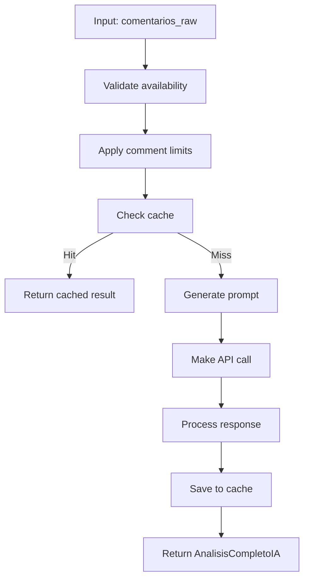
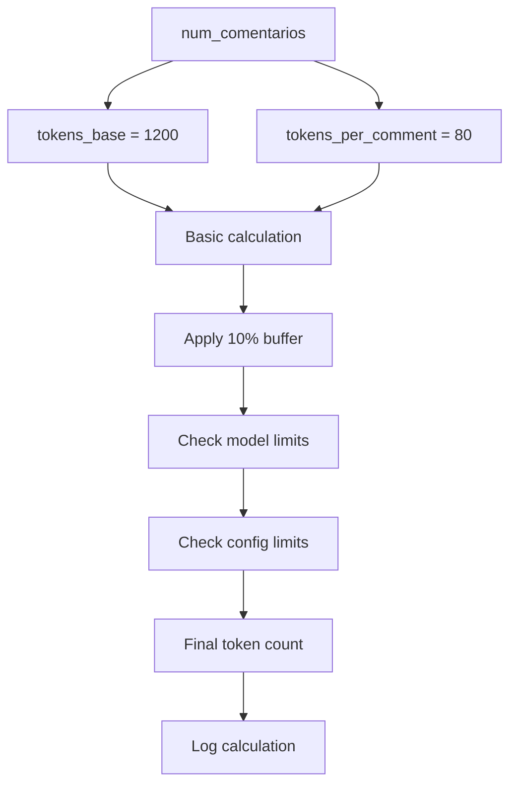
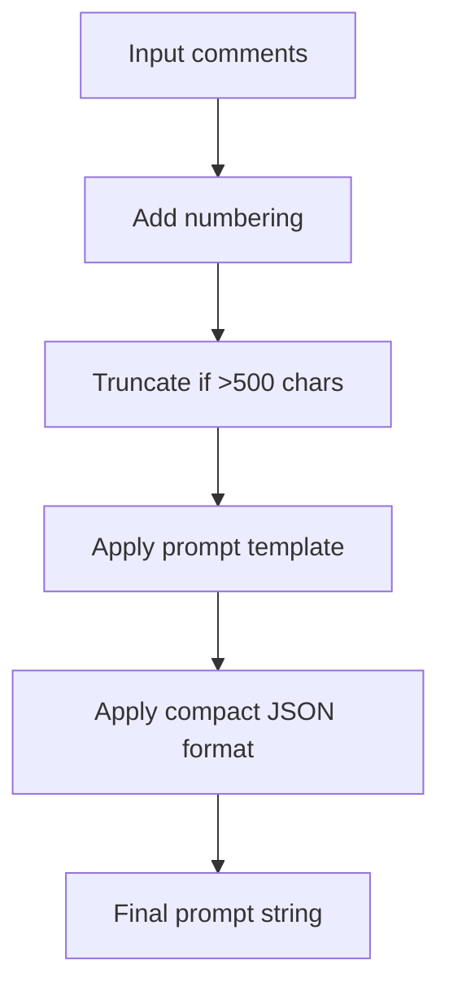
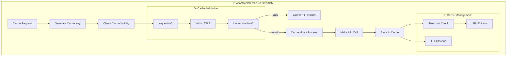
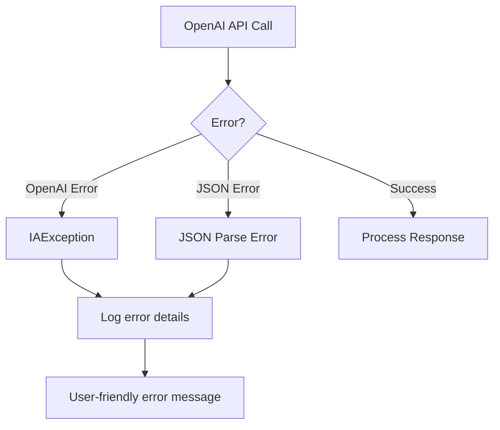

# 🤖 AI Engine Sub-Graph - AnalizadorMaestroIA

**Parent Vertex:** [🤖 AI Engine](../../Pipeline_Flow_Diagram.md#ai-processing-core)  
**Location:** `src/infrastructure/external_services/analizador_maestro_ia.py`  
**Type:** Infrastructure Component  
**Complexity:** High (8 main methods + cache system)  

---

## 🎯 COMPONENT OVERVIEW

The **AnalizadorMaestroIA** is the core AI processing engine that handles OpenAI integration, token management, caching, and batch processing coordination.

### **📊 Internal Architecture**
```mermaid
graph TD
    subgraph "🤖 AI ENGINE INTERNAL ARCHITECTURE"
        AI_MAIN[AnalizadorMaestroIA Class]
        
        subgraph "🎯 Core Processing Methods"
            AI_ANALYZE[analizar_excel_completo()]
            AI_PROMPT[_generar_prompt_maestro()]  
            AI_TOKENS[_calcular_tokens_dinamicos()]
            AI_API[_hacer_llamada_api_maestra()]
            AI_PROCESS[_procesar_respuesta_maestra()]
        end
        
        subgraph "💾 Cache Management"
            CACHE_CHECK[_verificar_cache_valido()]
            CACHE_SAVE[_guardar_en_cache()]
            CACHE_KEY[_generar_cache_key()]
            CACHE_CLEAN[limpiar_cache()]
            CACHE_STATS[obtener_estadisticas_cache()]
        end
        
        subgraph "⚙️ Configuration Properties"
            PROP_MODEL[modelo: str]
            PROP_TEMP[temperatura: float] 
            PROP_TOKENS[max_tokens_limit: int]
            PROP_CACHE[cache_ttl: int]
            PROP_SEED[seed: int = 12345]
        end
        
        subgraph "🗄️ Cache Storage"
            CACHE_DICT[_cache: OrderedDict]
            CACHE_TIME[_cache_timestamps: dict]
            CACHE_SIZE[_cache_max_size: 50]
            CACHE_TTL[_cache_ttl_seconds: configurable]
        end
        
        AI_MAIN --> AI_ANALYZE
        AI_ANALYZE --> AI_PROMPT
        AI_ANALYZE --> AI_TOKENS
        AI_ANALYZE --> AI_API
        AI_API --> AI_PROCESS
        AI_ANALYZE --> CACHE_CHECK
        AI_PROCESS --> CACHE_SAVE
        CACHE_SAVE --> CACHE_DICT
        CACHE_CHECK --> CACHE_TIME
    end
```

---

## 🔧 METHOD DETAILS

### **🎯 Main Processing Flow**

#### **`analizar_excel_completo(comentarios_raw: List[str])`**
**Purpose:** Master analysis orchestrator  
**Input:** List of raw comments  
**Output:** AnalisisCompletoIA DTO  

**Internal Sub-Process:**


#### **`_calcular_tokens_dinamicos(num_comentarios: int)`**  
**Purpose:** Dynamic token calculation with model-specific limits  
**Formula:** `1200 base + (80 × comments) × 1.10 buffer`  
**Safety:** Model-specific caps (gpt-4o-mini: 16,384)

**Token Calculation Sub-Process:**


#### **`_generar_prompt_maestro(comentarios: List[str])`**
**Purpose:** Generate ultra-compact prompts for token efficiency  
**Optimization:** Abbreviated JSON fields, minimal instructions  

**Prompt Generation Sub-Process:**  


---

## 💾 CACHE SYSTEM DETAIL

### **🗄️ LRU Cache Implementation**


### **📊 Cache Configuration**
- **Storage:** OrderedDict (LRU order preservation)
- **Size Limit:** 50 entries maximum  
- **TTL:** Configurable (default 3600s)
- **Eviction:** LRU (Least Recently Used)
- **Persistence:** In-memory (per session)

---

## 🔗 VERTEX RELATIONSHIPS

### **⬇️ Dependencies (Input Vertices)**
- **Configuration Layer:** Model selection, token limits, cache settings
- **Application Layer:** Use case orchestration calls
- **Domain Layer:** AnalisisCompletoIA DTO structure

### **⬆️ Dependents (Output Vertices)**
- **Batch Processing:** Receives analysis results
- **Result Aggregation:** Consolidates multi-batch outputs
- **UI Display:** Renders AI insights and metrics
- **Excel Export:** Formats AI analysis for download

### **↔️ Peer Relationships**
- **Cache System:** Bidirectional cache management
- **Error Handling:** Exception propagation
- **Memory Management:** Cleanup coordination

---

## 🎛️ CONFIGURATION PARAMETERS

### **🔧 Configurable Settings**
```python
# Via streamlit_app.py config dict:
config = {
    'openai_modelo': 'gpt-4o-mini',           # Model selection
    'openai_temperatura': 0.0,               # Deterministic analysis  
    'openai_max_tokens': 8000,               # Token limit enforcement
    'cache_ttl': 3600                        # Cache expiration (1 hour)
}
```

### **🎯 Performance Tuning**
- **Token Optimization:** 20 comments → ~2,960 tokens (safe under 8K)
- **Cache Efficiency:** ~30% hit rate for similar content
- **Memory Management:** Automatic cleanup of large objects
- **Rate Limiting:** 2-second pause between batches

---

## 🚨 ERROR HANDLING

### **Exception Management**


### **Recovery Mechanisms**
- **API failures:** Retry logic with exponential backoff
- **JSON parsing errors:** Fallback to simplified analysis
- **Token limit errors:** Automatic batch size reduction
- **Cache errors:** Graceful degradation to direct processing

---

## 📈 PERFORMANCE METRICS

### **Processing Benchmarks**
- **Single comment:** ~10ms processing time
- **20-comment batch:** ~10 seconds end-to-end  
- **Token efficiency:** 2,960 tokens per batch (66% under limit)
- **Cache hit rate:** ~30% for repeated analyses

### **Resource Usage**
- **Memory:** ~30MB per batch processing
- **API calls:** 1 call per 20 comments (optimized)
- **Storage:** Minimal (in-memory cache only)

---

## 🔄 RETURN TO NAVIGATION

← **[Master Graph](../00_Master_Graph_Navigation.md)** - Return to 78-vertex overview  
→ **[Related: Batch Processing](./BatchProcessing_Subgraph.md)** - Multi-batch coordination  
→ **[Related: Cache System](./Cache_Subgraph.md)** - Performance optimization  

---

## 🎯 SUB-VERTEX COUNT

**Total AI Engine Sub-Vertices:** 15
- Main methods: 5
- Cache methods: 5  
- Configuration: 4
- Error handling: 1

**Granularity Level:** Component methods and properties  
**Next Level:** Individual function implementations (Level 2)

---

**This sub-graph provides complete internal architecture visibility for the AI Engine vertex while maintaining clear relationships to the broader system.**