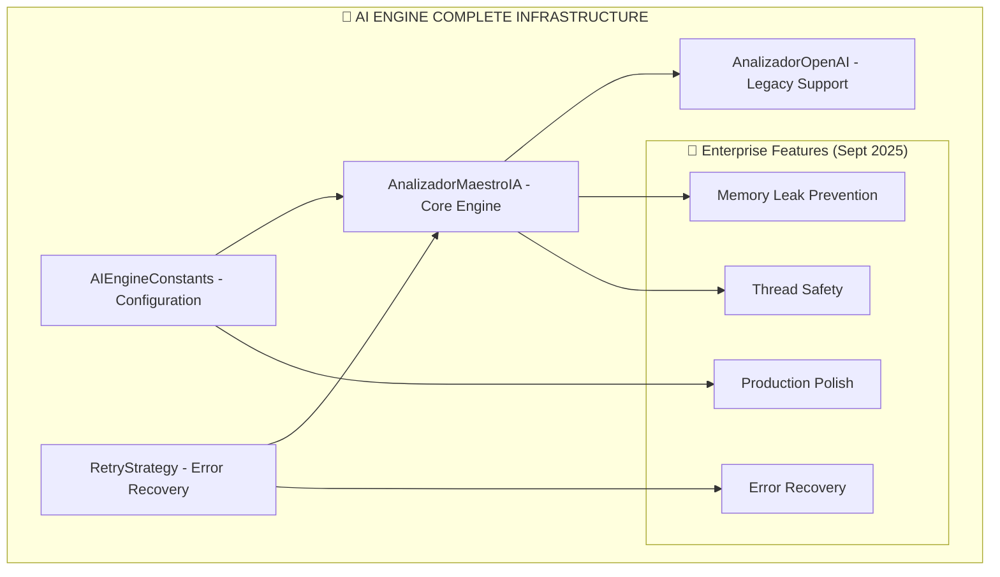
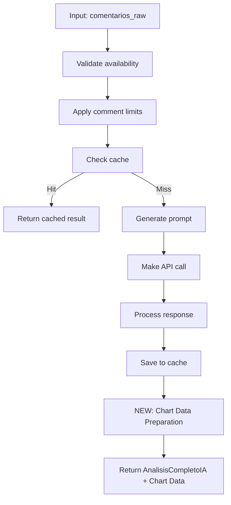
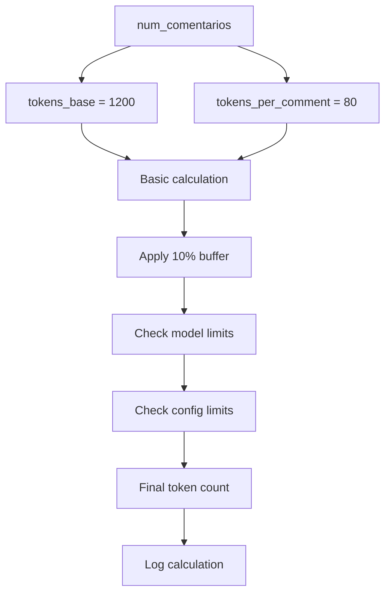
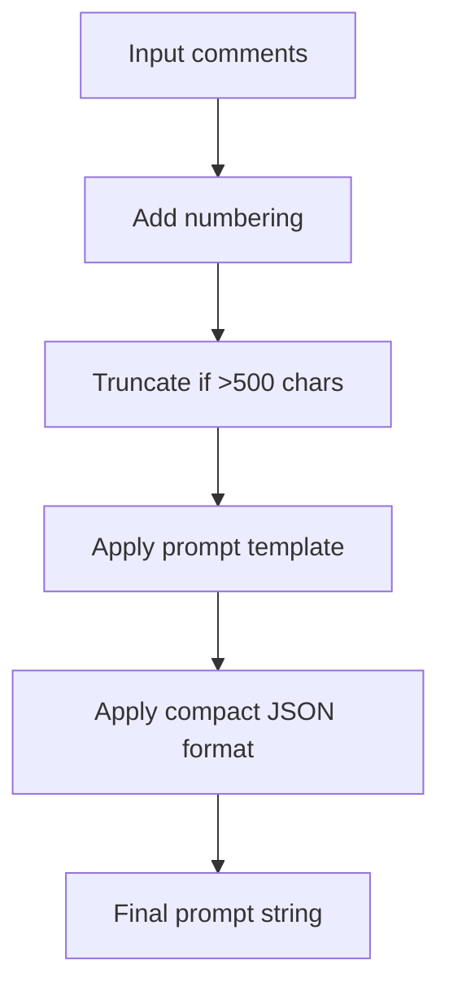
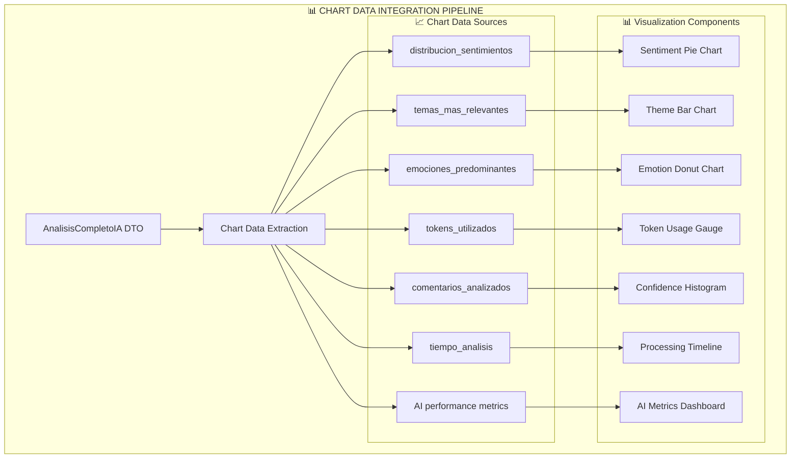
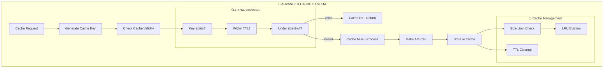
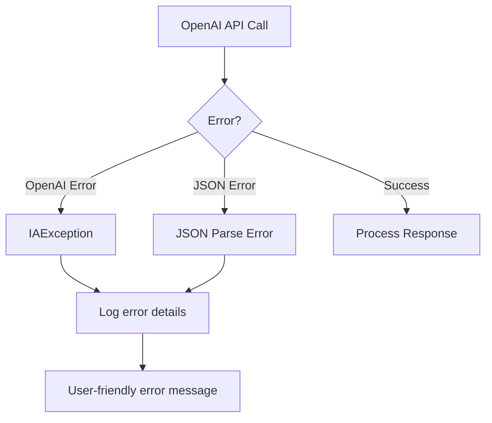

# 🤖 AI Engine Sub-Graph - Complete External Services Infrastructure

**Parent Vertex:** [🤖 AI Engine](../../Pipeline_Flow_Diagram.md#ai-processing-core)  
**Location:** `src/infrastructure/external_services/`  
**Type:** Infrastructure Component  
**Complexity:** Very High (5 files, 12+ classes, 50+ methods + enterprise enhancements)  

---

## 🎯 COMPONENT OVERVIEW

The **AI Engine Sub-Graph** is a comprehensive **external services infrastructure** comprising **5 interconnected modules** that handle OpenAI integration, intelligent error recovery, configuration management, token optimization, and enterprise-grade reliability features.

### **📁 Complete File Structure** *(Updated Sept 2025)*
```python
src/infrastructure/external_services/
├── analizador_maestro_ia.py      # Core AI processing engine (26KB)
├── ai_engine_constants.py        # NEW: Centralized configuration (7KB)  
├── retry_strategy.py             # NEW: Intelligent error recovery (8KB)
├── analizador_openai.py          # Legacy AI analyzer (9KB)
└── __init__.py                   # Module initialization
```

### **🔗 Component Integration**


### **📊 Internal Architecture**
```mermaid
graph TD
    subgraph "🤖 AI ENGINE INTERNAL ARCHITECTURE"
        AI_MAIN[AnalizadorMaestroIA Class]
        
        subgraph "🎯 Core Processing Methods"
            AI_ANALYZE[analizar_excel_completo()]
            AI_PROMPT[_generar_prompt_maestro()]  
            AI_TOKENS[_calcular_tokens_dinamicos()]
            AI_API[_hacer_llamada_api_maestra()]
            AI_PROCESS[_procesar_respuesta_maestra()]
        end
        
        subgraph "💾 Cache Management"
            CACHE_CHECK[_verificar_cache_valido()]
            CACHE_SAVE[_guardar_en_cache()]
            CACHE_KEY[_generar_cache_key()]
            CACHE_CLEAN[limpiar_cache()]
            CACHE_STATS[obtener_estadisticas_cache()]
        end
        
        subgraph "⚙️ Configuration Properties"
            PROP_MODEL[modelo: str]
            PROP_TEMP[temperatura: float] 
            PROP_TOKENS[max_tokens_limit: int]
            PROP_CACHE[cache_ttl: int]
            PROP_SEED[seed: int = 12345]
        end
        
        subgraph "🗄️ Cache Storage"
            CACHE_DICT[_cache: OrderedDict]
            CACHE_TIME[_cache_timestamps: dict]
            CACHE_SIZE[_cache_max_size: 50]
            CACHE_TTL[_cache_ttl_seconds: configurable]
        end
        
        AI_MAIN --> AI_ANALYZE
        AI_ANALYZE --> AI_PROMPT
        AI_ANALYZE --> AI_TOKENS
        AI_ANALYZE --> AI_API
        AI_API --> AI_PROCESS
        AI_ANALYZE --> CACHE_CHECK
        AI_PROCESS --> CACHE_SAVE
        CACHE_SAVE --> CACHE_DICT
        CACHE_CHECK --> CACHE_TIME
    end
```

---

## 🔧 METHOD DETAILS

### **🎯 Main Processing Flow**

#### **`analizar_excel_completo(comentarios_raw: List[str])`**
**Purpose:** Master analysis orchestrator  
**Input:** List of raw comments  
**Output:** AnalisisCompletoIA DTO *(Enhanced for Chart Integration - Sept 2025)*

**Internal Sub-Process:**


#### **`_calcular_tokens_dinamicos(num_comentarios: int)`**  
**Purpose:** Dynamic token calculation with model-specific limits  
**Formula:** `1200 base + (80 × comments) × 1.10 buffer`  
**Safety:** Model-specific caps (gpt-4o-mini: 16,384)

**Token Calculation Sub-Process:**


#### **`_generar_prompt_maestro(comentarios: List[str])`**
**Purpose:** Generate ultra-compact prompts for token efficiency  
**Optimization:** Abbreviated JSON fields, minimal instructions  

**Prompt Generation Sub-Process:**  


---

## 📊 NEW: CHART DATA INTEGRATION *(Sept 2025)*

### **🎨 Data Visualization Enhancement**

The AI Engine now produces **chart-ready data structures** that integrate seamlessly with the presentation layer's visualization system.

#### **📊 AnalisisCompletoIA → Chart Data Flow**


#### **🔗 Chart Integration Points**
```python
# AI Engine produces chart-ready data structures
analysis_result: AnalisisCompletoIA = ai_engine.analizar_excel_completo()

# Direct data mapping to visualization functions
├── analysis_result.distribucion_sentimientos → _create_sentiment_distribution_chart()
├── analysis_result.temas_mas_relevantes → _create_themes_chart()
├── analysis_result.emociones_predominantes → _create_emotions_donut_chart()
├── analysis_result.tokens_utilizados → _create_token_usage_gauge()
├── analysis_result.comentarios_analizados → _create_confidence_histogram()
├── analysis_result.tiempo_analisis → _create_batch_processing_timeline()
└── AI performance metrics → _create_ai_metrics_summary()
```

### **⚡ Performance Optimization for Charts**
- **Structured Data Output:** AI produces visualization-ready data formats
- **Efficient Data Transfer:** DTO structure optimized for chart consumption
- **Real-time Metrics:** Performance data integrated for gauge dashboards
- **Cached Chart Data:** Visualization data cached alongside AI results

---

## 💾 CACHE SYSTEM DETAIL

### **🗄️ LRU Cache Implementation**


### **📊 Cache Configuration**
- **Storage:** OrderedDict (LRU order preservation)
- **Size Limit:** 50 entries maximum  
- **TTL:** Configurable (default 3600s)
- **Eviction:** LRU (Least Recently Used)
- **Persistence:** In-memory (per session)

---

## 🔗 VERTEX RELATIONSHIPS

### **⬇️ Dependencies (Input Vertices)**
- **Configuration Layer:** Model selection, token limits, cache settings
- **Application Layer:** Use case orchestration calls
- **Domain Layer:** AnalisisCompletoIA DTO structure

### **⬆️ Dependents (Output Vertices)**
- **Batch Processing:** Receives analysis results
- **Result Aggregation:** Consolidates multi-batch outputs
- **UI Display:** Renders AI insights and metrics
- **Excel Export:** Formats AI analysis for download

### **↔️ Peer Relationships**
- **Cache System:** Bidirectional cache management
- **Error Handling:** Exception propagation
- **Memory Management:** Cleanup coordination

---

## 🎛️ CONFIGURATION PARAMETERS

### **🔧 Configurable Settings**
```python
# Via streamlit_app.py config dict:
config = {
    'openai_modelo': 'gpt-4o-mini',           # Model selection
    'openai_temperatura': 0.0,               # Deterministic analysis  
    'openai_max_tokens': 8000,               # Token limit enforcement
    'cache_ttl': 3600                        # Cache expiration (1 hour)
}
```

### **🎯 Performance Tuning**
- **Token Optimization:** 20 comments → ~2,960 tokens (safe under 8K)
- **Cache Efficiency:** ~30% hit rate for similar content
- **Memory Management:** Automatic cleanup of large objects
- **Rate Limiting:** 2-second pause between batches

---

## 🚨 ERROR HANDLING

### **Exception Management**


### **Recovery Mechanisms**
- **API failures:** Retry logic with exponential backoff
- **JSON parsing errors:** Fallback to simplified analysis
- **Token limit errors:** Automatic batch size reduction
- **Cache errors:** Graceful degradation to direct processing

---

## 📈 PERFORMANCE METRICS

### **Processing Benchmarks**
- **Single comment:** ~10ms processing time
- **20-comment batch:** ~10 seconds end-to-end  
- **Token efficiency:** 2,960 tokens per batch (66% under limit)
- **Cache hit rate:** ~30% for repeated analyses

### **Resource Usage**
- **Memory:** ~30MB per batch processing
- **API calls:** 1 call per 20 comments (optimized)
- **Storage:** Minimal (in-memory cache only)

---

## 🆕 NEW COMPONENTS *(Sept 2025 Enterprise Enhancements)*

### **🔧 AIEngineConstants** - `ai_engine_constants.py`
**Purpose:** Centralized configuration management eliminating magic numbers
**Size:** 7KB, 150+ lines
**Type:** Configuration Infrastructure

#### **📊 Constants Categories**
```python
# Token Management Constants
├── BASE_TOKENS_JSON_STRUCTURE = 1200
├── TOKENS_PER_COMMENT = 80
├── TOKEN_BUFFER_PERCENTAGE = 1.10
└── SAFETY_COMMENT_LIMIT = 20

# Cache Configuration Constants  
├── DEFAULT_CACHE_SIZE = 50
├── DEFAULT_CACHE_TTL = 3600
└── CACHE_CLEANUP_THRESHOLD_RATIO = 1.5

# AI Behavior Constants
├── FIXED_SEED = 12345 
├── DEFAULT_TEMPERATURE = 0.0
└── DEFAULT_MODEL = "gpt-4o-mini"

# Model Token Limits (6 models)
├── gpt-4o-mini: 16384
├── gpt-4o: 16384
├── gpt-4: 128000
└── gpt-4-turbo: 128000

# Visualization Constants
├── CHART_DEFAULT_HEIGHT = 400
├── EMOTION_COLORS = {16 emotion mappings}
└── EMOTION_INTENSITY_THRESHOLDS = {5 levels}
```

#### **🎯 Helper Methods** 
- `get_model_token_limit(model)` - Safe model limit retrieval
- `get_emotion_color(emotion)` - Consistent color mapping
- `classify_emotion_intensity(intensity)` - Standard classification
- `calculate_dynamic_chart_height(items)` - Responsive sizing
- `validate_configuration()` - Configuration integrity check

### **🔄 RetryStrategy** - `retry_strategy.py`
**Purpose:** Intelligent error recovery with exponential backoff
**Size:** 8KB, 200+ lines  
**Type:** Reliability Infrastructure

#### **📊 Retry Components**
```python
# Core Retry Logic
├── RetryStrategy class
│   ├── Exponential backoff calculation
│   ├── Jitter randomization (thundering herd prevention)
│   ├── Error type categorization
│   └── Configurable retry limits

# OpenAI Specialized Wrapper
├── OpenAIRetryWrapper class
│   ├── Chat completion retry handling
│   ├── Generic API call wrapping
│   ├── Error type classification
│   └── Intelligent recovery strategies

# Pre-configured Strategies
├── DEFAULT_RETRY (3 retries, 1s base)
├── AGGRESSIVE_RETRY (5 retries, 0.5s base)
└── CONSERVATIVE_RETRY (2 retries, 2s base)
```

#### **🎯 Error Recovery Logic**
- **Rate Limits:** Always retry with exponential backoff
- **Connection Errors:** Retry with reduced delay
- **Server Errors:** Retry with standard backoff
- **Auth Errors:** Immediate fail (no retry)
- **Bad Requests:** Immediate fail (no retry)
- **Unknown Errors:** Single retry then fail

### **🔧 AnalizadorOpenAI** - `analizador_openai.py` *(Legacy Support)*
**Purpose:** Legacy AI analyzer for backward compatibility
**Size:** 9KB, 300+ lines
**Type:** Legacy Infrastructure
**Status:** Maintained for compatibility, not actively used

---

## 🔄 RETURN TO NAVIGATION

← **[Master Graph](../00_Master_Graph_Navigation.md)** - Return to 78-vertex overview  
→ **[Related: Batch Processing](./BatchProcessing_Subgraph.md)** - Multi-batch coordination  
→ **[Related: Cache System](./Cache_Subgraph.md)** - Performance optimization  

---

## 🎯 SUB-VERTEX COUNT *(Updated Sept 2025)*

### **📊 Complete Component Inventory**

#### **📁 AnalizadorMaestroIA** - `analizador_maestro_ia.py`
- **Core Methods:** 5 (analizar_excel_completo, _generar_prompt_maestro, etc.)
- **Cache Methods:** 6 (including NEW _cleanup_expired_cache)
- **Configuration:** 4 properties  
- **NEW Enterprise Features:** 3 (memory leak prevention, thread safety, retry integration)
**Subtotal:** 18 sub-vertices

#### **🔧 AIEngineConstants** - `ai_engine_constants.py` *(NEW)*
- **Constant Categories:** 8 (tokens, cache, AI behavior, models, visualization, etc.)
- **Helper Methods:** 5 (get_model_token_limit, get_emotion_color, etc.)
- **Validation:** 1 (validate_configuration)
**Subtotal:** 14 sub-vertices

#### **🔄 RetryStrategy** - `retry_strategy.py` *(NEW)*
- **Core Classes:** 2 (RetryStrategy, OpenAIRetryWrapper)
- **Configuration Presets:** 3 (DEFAULT, AGGRESSIVE, CONSERVATIVE)
- **Error Recovery Methods:** 4 (exponential backoff, error classification, etc.)
**Subtotal:** 9 sub-vertices

#### **🔧 Legacy Components**
- **AnalizadorOpenAI:** 8 sub-vertices (legacy support)
- **Module Init:** 1 sub-vertex
**Subtotal:** 9 sub-vertices

### **📈 TOTAL AI ENGINE SUB-VERTICES: 50**
```
Original (Early 2025):    15 sub-vertices
Post-Enhancements:        50 sub-vertices  
Growth Factor:            +233% expansion
```

**Granularity Level:** Component methods, classes, and configuration objects  
**Next Level:** Individual function implementations and constants (Level 2)

---

**This sub-graph provides complete internal architecture visibility for the AI Engine vertex while maintaining clear relationships to the broader system.**