# 📦 Batch Processing Sub-Graph - Multi-Batch Orchestration

**Parent Vertex:** [📦 Multi-Batch Processing](../../Pipeline_Flow_Diagram.md#multi-batch-flow)  
**Location:** `src/application/use_cases/analizar_excel_maestro_caso_uso.py`  
**Type:** Application Infrastructure  
**Purpose:** Handle 1000-1200 comments in 20-comment batches  

---

## 🎯 BATCH PROCESSING OVERVIEW

The **Batch Processing System** enables processing large Excel files (1000-1200 comments) by intelligently splitting them into manageable batches that respect OpenAI token limits and rate limiting.

### **📊 Batch Processing Architecture**
```mermaid
graph TD
    subgraph "📦 BATCH PROCESSING SYSTEM"
        BATCH_MAIN[_procesar_en_lotes()]
        
        subgraph "🔧 Batch Management"
            BATCH_SPLIT[Create Batches]
            BATCH_COUNT[Calculate Batch Count]
            BATCH_SIZE[Validate Batch Size]
        end
        
        subgraph "🔄 Processing Loop"
            BATCH_ITER[Iterate Batches]
            BATCH_PROCESS[Process Single Batch]
            BATCH_PAUSE[Rate Limiting (2s)]
            BATCH_COLLECT[Collect Results]
        end
        
        subgraph "📈 Result Aggregation"  
            AGG_SENTIMENTS[Aggregate Sentiments]
            AGG_THEMES[Combine Themes]
            AGG_CONFIDENCE[Calculate Avg Confidence]
            AGG_TOKENS[Sum Token Usage]
            AGG_TIME[Sum Processing Time]
            AGG_FINAL[Create Final AnalisisCompletoIA]
        end
        
        subgraph "🚨 Error Handling"
            ERR_BATCH[Batch Failure Detection]
            ERR_CONTINUE[Continue with Next Batch]
            ERR_PARTIAL[Partial Results Handling]
        end
        
        BATCH_MAIN --> BATCH_SPLIT
        BATCH_SPLIT --> BATCH_COUNT
        BATCH_COUNT --> BATCH_SIZE
        BATCH_SIZE --> BATCH_ITER
        BATCH_ITER --> BATCH_PROCESS
        BATCH_PROCESS --> BATCH_PAUSE
        BATCH_PAUSE --> BATCH_COLLECT
        BATCH_COLLECT --> AGG_SENTIMENTS
        BATCH_COLLECT --> AGG_THEMES
        BATCH_COLLECT --> AGG_CONFIDENCE
        BATCH_COLLECT --> AGG_TOKENS
        BATCH_COLLECT --> AGG_TIME
        AGG_TIME --> AGG_FINAL
        
        BATCH_PROCESS -.-> ERR_BATCH
        ERR_BATCH -.-> ERR_CONTINUE
        ERR_CONTINUE -.-> ERR_PARTIAL
    end
```

---

## 🔧 METHOD IMPLEMENTATIONS

### **📦 `_procesar_en_lotes(comentarios_validos: List[str])`**

#### **Batch Creation Logic**
```python
# Intelligent batch splitting
lotes = [
    comentarios_validos[i:i + self.max_comments_per_batch]
    for i in range(0, len(comentarios_validos), self.max_comments_per_batch)
]

# Example: 1200 comments ÷ 20 = 60 batches
```

#### **Processing Loop with Error Resilience**
```python
for i, lote in enumerate(lotes):
    logger.info(f"🔄 Procesando lote {i+1}/{len(lotes)} ({len(lote)} comentarios)")
    
    try:
        resultado_lote = self.analizador_maestro.analizar_excel_completo(lote)
        
        if resultado_lote.es_exitoso():
            resultados_lotes.append(resultado_lote)
            comentarios_analizados_total.extend(resultado_lote.comentarios_analizados)
        else:
            logger.error(f"❌ Error en lote {i+1}")
            continue  # Continue with next batch
            
    except Exception as e:
        logger.error(f"Exception in batch {i+1}: {str(e)}")
        continue
    
    # Rate limiting
    if i < len(lotes) - 1:
        time.sleep(2)  # 2-second pause
```

### **📈 `_agregar_resultados_lotes()` - Result Consolidation**

#### **Sentiment Aggregation**
```python
# Combine sentiments from all batches
total_positivos = sum(r.distribucion_sentimientos.get('positivo', 0) for r in resultados_lotes)
total_neutrales = sum(r.distribucion_sentimientos.get('neutral', 0) for r in resultados_lotes)  
total_negativos = sum(r.distribucion_sentimientos.get('negativo', 0) for r in resultados_lotes)

# Determine overall trend
max_sentimiento = max(total_positivos, total_neutrales, total_negativos)
if max_sentimiento == total_positivos:
    tendencia_general = 'positiva'
elif max_sentimiento == total_negativos:
    tendencia_general = 'negativa'
else:
    tendencia_general = 'neutral'
```

#### **Theme Consolidation**
```python
# Combine and weight themes from all batches
temas_combinados = {}
for resultado in resultados_lotes:
    for tema, relevancia in resultado.temas_mas_relevantes.items():
        temas_combinados[tema] = temas_combinados.get(tema, 0) + relevancia
        
# Sort by combined relevance
temas_ordenados = sorted(temas_combinados.items(), key=lambda x: x[1], reverse=True)
```

---

## 📊 PROCESSING SCENARIOS

### **🎯 Scenario 1: Small File (≤20 comments)**

```mermaid
graph TD
    INPUT[20 comments] --> CHECK{Size check}
    CHECK -->|≤20| DIRECT[Direct processing]
    DIRECT --> SINGLE[Single AI call]
    SINGLE --> RESULT[AnalisisCompletoIA]
```


### **📦 Scenario 2: Medium File (100-500 comments)**

```mermaid
graph TD
    INPUT[300 comments] --> CHECK{Size check}
    CHECK -->|>20| BATCH[Batch processing]
    BATCH --> SPLIT[Split: 15 batches × 20]
    SPLIT --> LOOP[Process 15 batches]
    LOOP --> WAIT[2s pause × 14 times]
    WAIT --> AGG[Aggregate results]
    AGG --> RESULT[Consolidated AnalisisCompletoIA]
```


### **🗂️ Scenario 3: Large File (1000-1200 comments)**

```mermaid
graph TD
    INPUT[1200 comments] --> VALIDATE[Validate ≤1200]
    VALIDATE --> BATCH[Batch processing]
    BATCH --> SPLIT[Split: 60 batches × 20]
    SPLIT --> PROCESS[Process 60 batches]
    PROCESS --> TIMING[~10 minutes total]
    TIMING --> AGGREGATE[Aggregate 60 results]  
    AGGREGATE --> FINAL[Final consolidated result]
```


---

## ⚡ PERFORMANCE CHARACTERISTICS

### **📈 Processing Metrics**
```yaml
Batch Size: 20 comments (ultra-optimized)
Token Usage: ~2,960 per batch (safe under 8K limit)
Processing Time: ~10 seconds per batch
Rate Limiting: 2-second pause between batches
Memory Usage: ~30MB per batch

Large File Processing:
- 1000 comments: 50 batches × 10s = ~8.5 minutes
- 1200 comments: 60 batches × 10s = ~10 minutes
- Success Rate: 100% (error-resilient with partial results)
```

### **🛡️ Error Resilience**
- **Batch failure isolation:** Failed batch doesn't stop processing
- **Partial results:** Can complete analysis even with some batch failures
- **Retry logic:** Could be enhanced with retry on individual batch failures
- **Progress tracking:** Detailed logging of batch processing status

---

## 🔄 INTEGRATION WITH AI ENGINE

### **🤖 AI Engine Calls per Batch**


### **💾 Cache Interaction**  


---

## 📋 BATCH PROCESSING SUB-VERTICES

### **🔧 Core Processing (6 Sub-Vertices)**
1. **Batch Splitter** - Intelligent comment grouping
2. **Processing Iterator** - Batch loop management  
3. **Rate Limiter** - 2-second pause coordination
4. **Result Collector** - Batch result accumulation
5. **Error Handler** - Batch failure management
6. **Progress Tracker** - Status logging and reporting

### **📈 Aggregation Engine (5 Sub-Vertices)**
1. **Sentiment Aggregator** - Cross-batch sentiment consolidation
2. **Theme Combiner** - Theme relevance weighting
3. **Confidence Calculator** - Average confidence computation
4. **Metrics Consolidator** - Token usage + timing aggregation  
5. **Final DTO Creator** - Consolidated AnalisisCompletoIA generation

### **🚨 Quality Assurance (3 Sub-Vertices)**
1. **Batch Validator** - Size and content validation
2. **Partial Results Handler** - Incomplete analysis management
3. **Success Rate Monitor** - Processing success tracking

---

## 🎯 CONFIGURATION PARAMETERS

### **⚙️ Batch Configuration**
```python
# From dependency injection
max_comments_per_batch: int = 20  # Ultra-conservative for 8K tokens
file_size_limit: int = 1200       # Maximum comments per file
min_file_size: int = 100          # Minimum for batch processing
rate_limit_pause: float = 2.0     # Seconds between batches
```

### **📊 Processing Limits**
- **Minimum batch size:** 1 comment (edge case handling)
- **Maximum batch size:** 20 comments (token limit compliance)
- **File size range:** 100-1200 comments (business requirements)
- **Rate limiting:** 2 seconds (OpenAI TPM compliance)

---

## 🔄 RETURN TO NAVIGATION

← **[Master Graph](../../00_Master_Graph_Navigation.md)** - Return to 78-vertex overview  
→ **[Related: AI Engine](./AI_Engine_Subgraph.md)** - AI processing details  
→ **[Related: Cache System](./Cache_Subgraph.md)** - Performance optimization  

---

**This batch processing system enables reliable large-file analysis while maintaining OpenAI API compliance and providing excellent user experience with progress tracking and error resilience.**