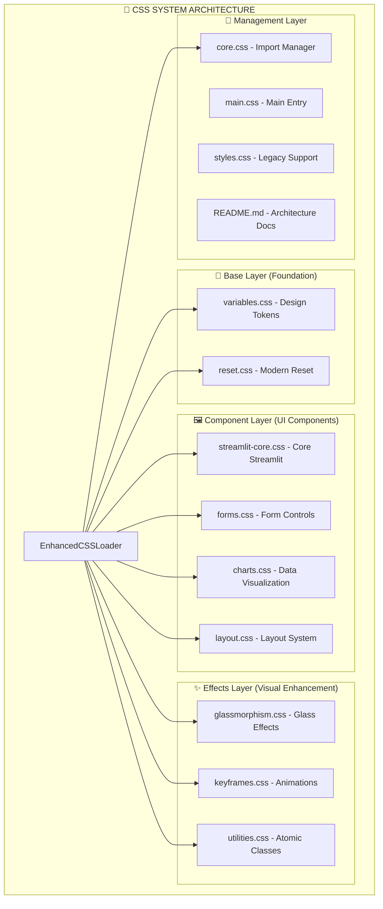

# 🎨 CSS System Sub-Graph - Advanced Modular Architecture

**Parent Vertex:** [🎨 CSS System](../../Pipeline_Flow_Diagram.md#css-system-integration)  
**Location:** `static/css/` + `src/presentation/streamlit/enhanced_css_loader.py`  
**Type:** Presentation Infrastructure  
**Complexity:** High (15 CSS files + orchestration system)  

---

## 🎯 CSS SYSTEM OVERVIEW

The **CSS System** is a sophisticated **modular CSS architecture** with design tokens, glassmorphism effects, and intelligent loading orchestration - far exceeding typical Streamlit styling.

### **📊 CSS Architecture Hierarchy**


---

## 📁 FILE STRUCTURE DETAIL

### **🎨 CSS File Inventory (15 Files)**

#### **📄 Base Layer (2 files)**
```css
static/css/base/
├── variables.css (Design Tokens)
│   ├── Color palette: --primary-purple: #8B5CF6, --secondary-cyan: #06B6D4
│   ├── Typography: --font-primary: 'Inter'
│   ├── Spacing: --spacing-* variables  
│   ├── Borders: --border-radius-* variables
│   └── Glassmorphism: --glass-* variables
│
└── reset.css (Modern CSS Reset)
    ├── Box-sizing: border-box normalization
    ├── Typography: Font smoothing & optimization
    ├── Form elements: Consistent cross-browser styling
    └── Focus management: Accessibility improvements
```

#### **🖼️ Component Layer (4 files)**
```css
static/css/components/
├── streamlit-core.css (Core Streamlit Elements)
│   ├── .stButton styling with gradients
│   ├── .stSelectbox custom styling
│   ├── .stTextInput enhancements
│   └── Streamlit container modifications
│
├── forms.css (Form Controls)
│   ├── Input field styling
│   ├── File upload areas
│   ├── Form validation states
│   └── Interactive form feedback
│
├── charts.css (Data Visualization)  
│   ├── Plotly chart container styling
│   ├── Metric display enhancements
│   ├── Chart hover effects
│   └── Data table styling
│
└── layout.css (Layout System)
    ├── Grid system classes
    ├── Flexbox utilities
    ├── Container sizing
    └── Responsive breakpoints
```

#### **✨ Effects Layer (3 files)**
```css
static/css/
├── glassmorphism.css (Advanced Glass Effects)
│   ├── .glass base class: backdrop-filter: blur(16px)
│   ├── .glass-card: Enhanced glass cards
│   ├── .glass-elevated: Hover effects
│   └── Hardware acceleration optimizations
│
├── animations/keyframes.css (Animation System)
│   ├── @keyframes fadeIn, slideUp, scaleIn
│   ├── Hover transitions
│   ├── Loading animations
│   └── Micro-interactions
│
└── utils/utilities.css (Atomic Utilities)
    ├── Text utilities (.text-center, .text-bold)
    ├── Spacing utilities (.m-*, .p-*)
    ├── Color utilities (.text-*, .bg-*)
    └── Display utilities (.d-flex, .d-grid)
```

---

## 🎛️ CSS ORCHESTRATION SYSTEM

### **🔧 EnhancedCSSLoader Methods**

#### **`ensure_css_loaded()`** - Main Orchestrator
```python
def ensure_css_loaded() -> bool:
    """Load CSS cascade in optimal order"""
    css_files = [
        'static/css/base/variables.css',      # 1. Design tokens first
        'static/css/base/reset.css',          # 2. CSS reset
        'static/css/components/layout.css',   # 3. Layout system  
        'static/css/components/streamlit-core.css', # 4. Core components
        'static/css/components/forms.css',    # 5. Form styling
        'static/css/components/charts.css',   # 6. Chart styling
        'static/css/glassmorphism.css',       # 7. Glass effects
        'static/css/animations/keyframes.css', # 8. Animations
        'static/css/utils/utilities.css',    # 9. Utilities
        'static/main.css',                    # 10. Main styles
        'static/styles.css'                   # 11. Legacy compatibility
    ]
```

#### **`inject_page_css(page_name: str)`** - Page-Specific Styling
```python
# Page-specific CSS injection
page_styles = {
    'main': ['glassmorphism', 'animations'],
    'upload': ['forms', 'glassmorphism'],  
    'analysis': ['charts', 'glassmorphism']
}
```

#### **`_process_imports(css_content: str)`** - Import Resolution
```python
# Automatic @import processing
@import url('./variables.css');  # → Inlines variables.css content
@import url('./reset.css');      # → Inlines reset.css content
```

---

## 🎨 DESIGN TOKEN SYSTEM

### **🌈 Color Palette**
```css
:root {
    /* Primary Brand Colors */
    --primary-purple: #8B5CF6;
    --secondary-cyan: #06B6D4;
    --accent-indigo: #6366F1;
    
    /* Semantic Colors */
    --success: #10B981;
    --warning: #F59E0B;  
    --error: #EF4444;
    --info: #3B82F6;
    
    /* Glassmorphism Colors */
    --glass-bg: rgba(255, 255, 255, 0.08);
    --glass-border: rgba(255, 255, 255, 0.15);
    --glass-shadow: rgba(139, 92, 246, 0.08);
}
```

### **✨ Glassmorphism Effects**
```css
.glass {
    background: var(--glass-bg);
    backdrop-filter: blur(16px);
    -webkit-backdrop-filter: blur(16px);
    border: 1px solid var(--glass-border);
    border-radius: 16px;
    box-shadow: 0 2px 8px var(--glass-shadow);
}

.glass-card:hover {
    transform: translateY(-2px);
    box-shadow: 0 8px 20px rgba(139, 92, 246, 0.25);
}
```

---

## 🔗 CSS INTEGRATION POINTS

### **🖇️ Streamlit Component Integration**
```css
/* Button styling with glassmorphism */
.stButton > button {
    background: linear-gradient(135deg, var(--primary-purple), var(--secondary-cyan));
    backdrop-filter: blur(10px);
    border: 1px solid rgba(255, 255, 255, 0.1);
}

/* Metric cards with glass effects */
.metric-card {
    @extend .glass-card;
    padding: 1.5rem;
    transition: transform 0.3s ease;
}
```

### **📊 Chart Styling Integration** 
```css
/* Plotly chart enhancements */
.plotly-graph-div {
    background: var(--glass-bg);
    border-radius: 12px;
    padding: 1rem;
}

/* Data table styling */
.dataframe {
    backdrop-filter: blur(8px);
    border: 1px solid var(--glass-border);
}
```

---

## 🚀 PERFORMANCE OPTIMIZATIONS

### **⚡ Loading Strategy**
- **Cascade order:** Variables → Reset → Layout → Components → Effects
- **Import inlining:** Automatic @import resolution
- **Deduplication:** Prevent duplicate CSS loading
- **Caching:** CSS content caching for performance

### **🖥️ Browser Optimization**  
- **Hardware acceleration:** transform3d() for animations
- **Will-change hints:** Optimize rendering pipeline
- **Reduced repaints:** Efficient CSS properties
- **Vendor prefixes:** Cross-browser compatibility

---

## 🔍 SUB-COMPONENT BREAKDOWN

### **📊 Sub-Vertex Inventory**
1. **EnhancedCSSLoader** (5 methods)
2. **Design Tokens** (20+ CSS variables)  
3. **Component Styles** (50+ CSS classes)
4. **Glass Effects** (10+ glassmorphism variants)
5. **Animations** (15+ keyframe animations)
6. **Utility Classes** (30+ atomic utilities)

### **🎯 Total CSS Sub-Vertices: 130+**
- CSS files: 15
- Methods: 5  
- Variables: 20+
- Classes: 50+
- Animations: 15+
- Utilities: 30+

---

## 🔄 RETURN TO NAVIGATION

← **[Master Graph](../../00_Master_Graph_Navigation.md)** - Return to 78-vertex overview  
→ **[Related: Pages System](../presentation/Pages_Subgraph.md)** - UI page components  
→ **[Related: Session Management](../presentation/Session_Subgraph.md)** - State management  

---

## 🎨 VISUAL EXAMPLES

### **Glassmorphism Effect**
- **Backdrop blur:** 16px blur with hardware acceleration
- **Transparency:** 8% white background with 15% border
- **Shadows:** Subtle purple glow effects
- **Hover states:** Transform and enhanced shadows

### **Professional Theme**
- **Purple-cyan gradients** on interactive elements
- **Consistent spacing** using design tokens
- **Modern typography** with Inter font family
- **Accessibility compliance** with proper focus states

---

**This CSS system represents enterprise-level UI infrastructure with professional glassmorphism effects and sophisticated modular architecture.**