# 🎨 CSS System Sub-Graph - Advanced Modular Architecture

**Parent Vertex:** [🎨 CSS System](../../Pipeline_Flow_Diagram.md#css-system-integration)  
**Location:** `static/css/` + `src/presentation/streamlit/enhanced_css_loader.py`  
**Type:** Presentation Infrastructure  
**Complexity:** High (15 CSS files + orchestration system)  

---

## 🎯 CSS SYSTEM OVERVIEW

The **CSS System** is a sophisticated **modular CSS architecture** with design tokens, glassmorphism effects, and intelligent loading orchestration - far exceeding typical Streamlit styling.

### **📊 CSS Architecture Hierarchy**

```mermaid
graph TD
    subgraph "🎨 CSS SYSTEM ARCHITECTURE"
        CSS_MAIN[EnhancedCSSLoader]
        
        subgraph "📁 Base Layer (Foundation)"
            CSS_VAR[variables.css - Design Tokens]
            CSS_RESET[reset.css - Modern Reset]
        end
        
        subgraph "🖼️ Component Layer (UI Components)"  
            CSS_CORE[streamlit-core.css - Core Streamlit]
            CSS_FORMS[forms.css - Form Controls]
            CSS_CHARTS[charts.css - Data Visualization]
            CSS_LAYOUT[layout.css - Layout System]
        end
        
        subgraph "✨ Effects Layer (Visual Enhancement)"
            CSS_GLASS[glassmorphism.css - Glass Effects]
            CSS_ANIM[keyframes.css - Animations]
            CSS_UTILS[utilities.css - Atomic Classes]
        end
        
        subgraph "🔧 Management Layer"
            CSS_CORE_FALLBACK[core.css - Import Manager]
            CSS_MAIN_ENTRY[main.css - Main Entry]
            CSS_LEGACY[styles.css - Legacy Support]
            CSS_DOCS[README.md - Architecture Docs]
        end
        
        CSS_MAIN --> CSS_VAR
        CSS_MAIN --> CSS_RESET
        CSS_MAIN --> CSS_CORE
        CSS_MAIN --> CSS_FORMS
        CSS_MAIN --> CSS_CHARTS
        CSS_MAIN --> CSS_LAYOUT
        CSS_MAIN --> CSS_GLASS
        CSS_MAIN --> CSS_ANIM
        CSS_MAIN --> CSS_UTILS
        CSS_MAIN --> CSS_CORE_FALLBACK
    end
```


---

## 📁 FILE STRUCTURE DETAIL

### **🎨 CSS File Inventory (15 Files)**

#### **📄 Base Layer (2 files)**
```css
static/css/base/
├── variables.css (Design Tokens)
│   ├── Color palette: --primary-purple: #8B5CF6, --secondary-cyan: #06B6D4
│   ├── Typography: --font-primary: 'Inter'
│   ├── Spacing: --spacing-* variables  
│   ├── Borders: --border-radius-* variables
│   └── Glassmorphism: --glass-* variables
│
└── reset.css (Modern CSS Reset)
    ├── Box-sizing: border-box normalization
    ├── Typography: Font smoothing & optimization
    ├── Form elements: Consistent cross-browser styling
    └── Focus management: Accessibility improvements
```

#### **🖼️ Component Layer (4 files)**
```css
static/css/components/
├── streamlit-core.css (Core Streamlit Elements)
│   ├── .stButton styling with gradients
│   ├── .stSelectbox custom styling
│   ├── .stTextInput enhancements
│   └── Streamlit container modifications
│
├── forms.css (Form Controls)
│   ├── Input field styling
│   ├── File upload areas
│   ├── Form validation states
│   └── Interactive form feedback
│
├── charts.css (Data Visualization)  
│   ├── Plotly chart container styling
│   ├── Metric display enhancements
│   ├── Chart hover effects
│   └── Data table styling
│
└── layout.css (Layout System)
    ├── Grid system classes
    ├── Flexbox utilities
    ├── Container sizing
    └── Responsive breakpoints
```

#### **✨ Effects Layer (3 files)**
```css
static/css/
├── glassmorphism.css (Advanced Glass Effects)
│   ├── .glass base class: backdrop-filter: blur(16px)
│   ├── .glass-card: Enhanced glass cards
│   ├── .glass-elevated: Hover effects
│   └── Hardware acceleration optimizations
│
├── animations/keyframes.css (Animation System)
│   ├── @keyframes fadeIn, slideUp, scaleIn
│   ├── Hover transitions
│   ├── Loading animations
│   └── Micro-interactions
│
└── utils/utilities.css (Atomic Utilities)
    ├── Text utilities (.text-center, .text-bold)
    ├── Spacing utilities (.m-*, .p-*)
    ├── Color utilities (.text-*, .bg-*)
    └── Display utilities (.d-flex, .d-grid)
```

---

## 🎛️ CSS ORCHESTRATION SYSTEM

### **🔧 EnhancedCSSLoader Methods** *(Recently Enhanced - Sept 2025)*

#### **`ensure_css_loaded()`** - Main Orchestrator
```python
def ensure_css_loaded() -> bool:
    """Load CSS cascade in optimal order with @import processing"""
    css_files = [
        'static/css/base/variables.css',      # 1. Design tokens first
        'static/css/base/reset.css',          # 2. CSS reset
        'static/css/components/layout.css',   # 3. Layout system  
        'static/css/components/streamlit-core.css', # 4. Core components
        'static/css/components/forms.css',    # 5. Form styling
        'static/css/components/charts.css',   # 6. Chart styling
        'static/css/glassmorphism.css',       # 7. Glass effects
        'static/css/animations/keyframes.css', # 8. Animations
        'static/css/utils/utilities.css',    # 9. Utilities
        'static/main.css',                    # 10. Main styles
        'static/styles.css'                   # 11. Legacy compatibility
    ]
    # NEW: Enhanced with _load_css_file_with_imports() for @import resolution
```

#### **`inject_page_css(page_name: str)`** - Page-Specific Styling
```python
# Page-specific CSS injection with chart optimization
page_styles = {
    'main': ['glassmorphism', 'animations'],
    'upload': ['forms', 'glassmorphism'],  
    'analysis': ['charts', 'glassmorphism', 'plotly-integration']  # NEW: Chart styling
}
```

#### **`_load_css_file_with_imports(file_path: str)`** - *NEW: Import Resolution*
```python
# NEW METHOD: Automatic @import processing and inlining
def _load_css_file_with_imports(file_path: str) -> str:
    """Process CSS files with automatic @import resolution"""
    # Resolves: @import url('./variables.css') → Inlined content
    # Resolves: @import url('./reset.css') → Inlined content
    # Enhanced error handling and relative path resolution
```

#### **`_get_analysis_page_css()`** - *NEW: Chart-Specific Styling*
```python
# NEW METHOD: Specialized CSS for data visualization pages
def _get_analysis_page_css() -> str:
    """Enhanced glassmorphism for plotly charts and metrics"""
    # Plotly-graph-div containers with glass effects
    # Metric containers with enhanced glassmorphism
    # Chart integration with purple-cyan theme consistency
```

---

## 🎨 DESIGN TOKEN SYSTEM

### **🌈 Color Palette**
```css
:root {
    /* Primary Brand Colors */
    --primary-purple: #8B5CF6;
    --secondary-cyan: #06B6D4;
    --accent-indigo: #6366F1;
    
    /* Semantic Colors */
    --success: #10B981;
    --warning: #F59E0B;  
    --error: #EF4444;
    --info: #3B82F6;
    
    /* Glassmorphism Colors */
    --glass-bg: rgba(255, 255, 255, 0.08);
    --glass-border: rgba(255, 255, 255, 0.15);
    --glass-shadow: rgba(139, 92, 246, 0.08);
}
```

### **✨ Glassmorphism Effects**
```css
.glass {
    background: var(--glass-bg);
    backdrop-filter: blur(16px);
    -webkit-backdrop-filter: blur(16px);
    border: 1px solid var(--glass-border);
    border-radius: 16px;
    box-shadow: 0 2px 8px var(--glass-shadow);
}

.glass-card:hover {
    transform: translateY(-2px);
    box-shadow: 0 8px 20px rgba(139, 92, 246, 0.25);
}
```

---

## 🔗 CSS INTEGRATION POINTS

### **🖇️ Streamlit Component Integration**
```css
/* Button styling with glassmorphism */
.stButton > button {
    background: linear-gradient(135deg, var(--primary-purple), var(--secondary-cyan));
    backdrop-filter: blur(10px);
    border: 1px solid rgba(255, 255, 255, 0.1);
}

/* Metric cards with glass effects */
.metric-card {
    @extend .glass-card;
    padding: 1.5rem;
    transition: transform 0.3s ease;
}
```

### **📊 Chart Styling Integration** *(Enhanced Sept 2025)*
```css
/* NEW: Enhanced Plotly chart integration */
.plotly-graph-div {
    background: var(--glass-bg);
    border-radius: 12px;
    padding: 1rem;
    backdrop-filter: blur(16px);  /* NEW: Enhanced glass effect */
    transition: transform 0.3s ease, box-shadow 0.3s ease;  /* NEW: Hover animations */
}

/* NEW: Chart container hover effects */
.plotly-graph-div:hover {
    transform: translateY(-2px);
    box-shadow: 0 8px 32px rgba(139, 92, 246, 0.15);
}

/* NEW: Metric containers with glassmorphism */
.metric-card {
    background: var(--glass-bg);
    backdrop-filter: blur(16px);
    border: 1px solid var(--glass-border);
    border-radius: 16px;
    padding: 1.5rem;
    transition: all 0.3s ease;
}

/* Enhanced data table styling */
.dataframe {
    backdrop-filter: blur(8px);
    border: 1px solid var(--glass-border);
    border-radius: 12px;  /* NEW: Consistent border radius */
}

/* NEW: Interactive chart theme consistency */
.plotly .modebar {
    background: rgba(139, 92, 246, 0.1);  /* Purple-cyan theme integration */
}
```

---

## 🚀 PERFORMANCE OPTIMIZATIONS *(Enhanced Sept 2025)*

### **⚡ Loading Strategy**
- **Cascade order:** Variables → Reset → Layout → Components → Effects
- **NEW: @Import inlining:** Automatic @import resolution with `_load_css_file_with_imports()`
- **Enhanced deduplication:** Prevent duplicate CSS loading across pages
- **Multi-level caching:** CSS content caching for performance
- **NEW: Fallback system:** Multi-tier fallback (enhanced → basic → emergency)

### **🖥️ Browser Optimization**  
- **Hardware acceleration:** transform3d() for animations
- **Will-change hints:** Optimize rendering pipeline
- **Reduced repaints:** Efficient CSS properties
- **Vendor prefixes:** Cross-browser compatibility
- **NEW: Chart optimization:** Optimized glassmorphism for plotly containers

### **📊 NEW: Chart Performance** *(Sept 2025)*
- **Transparent backgrounds:** Seamless CSS integration
- **GPU-accelerated effects:** backdrop-filter optimizations
- **Hover performance:** CSS transforms with will-change hints
- **Theme consistency:** Unified purple-cyan across all visual components

---

## 🔍 SUB-COMPONENT BREAKDOWN

### **📊 Sub-Vertex Inventory**
1. **EnhancedCSSLoader** (5 methods)
2. **Design Tokens** (20+ CSS variables)  
3. **Component Styles** (50+ CSS classes)
4. **Glass Effects** (10+ glassmorphism variants)
5. **Animations** (15+ keyframe animations)
6. **Utility Classes** (30+ atomic utilities)

### **🎯 Total CSS Sub-Vertices: 130+**
- CSS files: 15
- Methods: 5  
- Variables: 20+
- Classes: 50+
- Animations: 15+
- Utilities: 30+

---

## 🔄 RETURN TO NAVIGATION

← **[Master Graph](../../00_Master_Graph_Navigation.md)** - Return to 78-vertex overview  
→ **[Related: Pages System](../presentation/Pages_Subgraph.md)** - UI page components  
→ **[Related: Session Management](../presentation/Session_Subgraph.md)** - State management  

---

## 🎨 VISUAL EXAMPLES

### **Glassmorphism Effect**
- **Backdrop blur:** 16px blur with hardware acceleration
- **Transparency:** 8% white background with 15% border
- **Shadows:** Subtle purple glow effects
- **Hover states:** Transform and enhanced shadows

### **Professional Theme**
- **Purple-cyan gradients** on interactive elements
- **Consistent spacing** using design tokens
- **Modern typography** with Inter font family
- **Accessibility compliance** with proper focus states

---

**This CSS system represents enterprise-level UI infrastructure with professional glassmorphism effects and sophisticated modular architecture.**