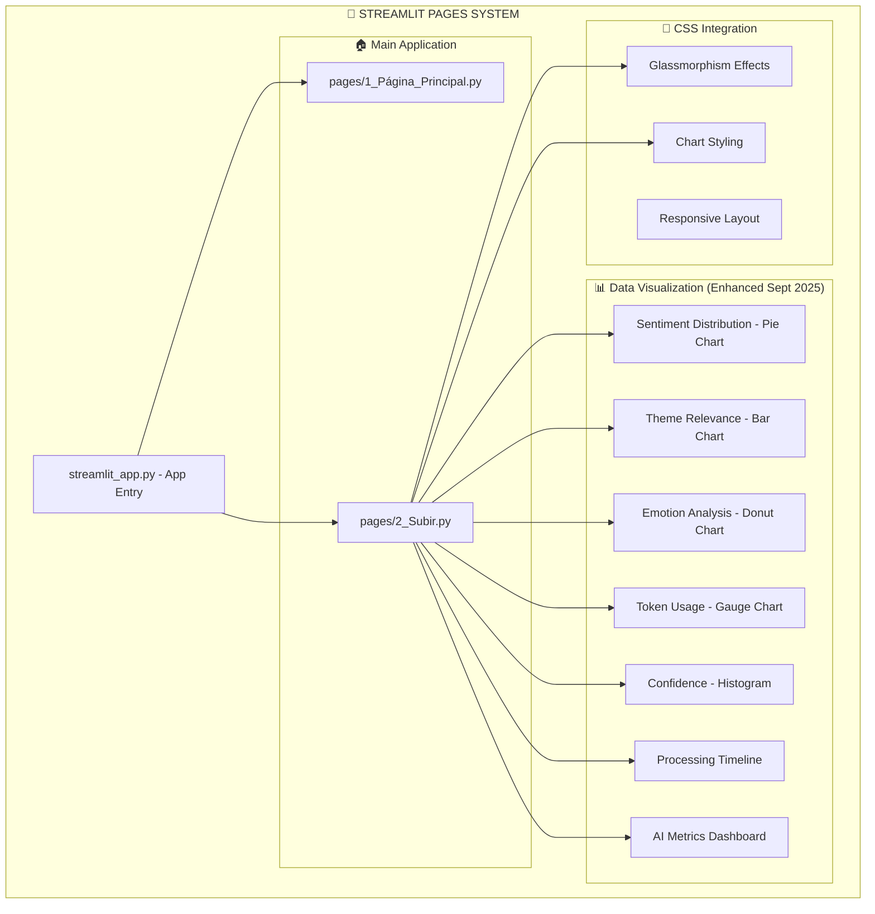

# 📄 Streamlit Pages Sub-Graph - UI Page Components

**Parent Vertex:** [📄 Streamlit Pages](../../00_Master_Graph_Navigation.md#presentation-layer)  
**Location:** `pages/` + `streamlit_app.py`  
**Type:** Presentation Layer  
**Complexity:** Medium (3 pages + navigation + data visualization)  

---

## 🎯 PAGES SYSTEM OVERVIEW

The **Streamlit Pages System** manages multi-page navigation with specialized UI components for comment analysis, featuring **professional data visualization** and **glassmorphism integration**.

### **📊 Pages Architecture**


---

## 📁 PAGE COMPONENTS DETAIL

### **🏠 streamlit_app.py** - Application Entry Point
```python
# Main application orchestrator
├── 🎨 CSS Loading (Enhanced)
│   ├── ensure_css_loaded() - Complete CSS cascade
│   ├── Glass effects integration
│   └── Chart styling coordination
├── 🔧 Navigation Setup
│   ├── Multi-page configuration  
│   ├── Sidebar navigation
│   └── Page state management
└── 📱 Responsive Layout
    ├── Container configuration
    ├── Sidebar optimization
    └── Mobile responsiveness
```

### **🏠 pages/1_Página_Principal.py** - Main Landing Page
```python
# Clean welcome interface with glassmorphism
├── 🎨 Enhanced UI (Sept 2025)
│   ├── Glassmorphism welcome cards
│   ├── Professional typography
│   └── Animated elements integration
├── 📋 Feature Overview
│   ├── Analysis capabilities showcase
│   ├── Interactive demo elements
│   └── Getting started guidance
└── 🔗 Navigation Links
    ├── Direct upload access
    ├── Documentation links
    └── System status indicators
```

### **📊 pages/2_Subir.py** - Upload & Analysis Page *(Major Enhancement Sept 2025)*

#### **Core Functionality**
```python
├── 📁 File Upload System
│   ├── Excel/CSV file handling
│   ├── File validation and preprocessing
│   └── Progress indicators with glassmorphism
├── 🤖 AI Analysis Integration  
│   ├── OpenAI API orchestration
│   ├── Token management and optimization
│   └── Batch processing coordination
└── 🎨 Enhanced CSS Integration
    ├── Page-specific styling: inject_page_css('upload', 'analysis')
    ├── Form glassmorphism effects
    └── Chart container optimization
```

#### **📊 NEW: Data Visualization System** *(Sept 2025)*
```python
# Professional interactive chart components
├── 🥧 _create_sentiment_distribution_chart()
│   ├── Pie chart with green/gray/red semantic colors
│   ├── Interactive hover information
│   └── Glassmorphism container integration
├── 📊 _create_themes_chart()
│   ├── Horizontal bar chart for theme relevance
│   ├── Purple-cyan color scheme alignment
│   └── Responsive design with use_container_width=True
├── 🍩 _create_emotions_donut_chart()
│   ├── Donut chart with emotion-specific colors
│   ├── Intensity mapping visualization  
│   └── Professional color psychology integration
├── ⚡ _create_token_usage_gauge()
│   ├── Real-time token monitoring
│   ├── Safety zones (green/yellow/red)
│   └── Performance optimization indicators
├── 📈 _create_confidence_histogram()
│   ├── Analysis quality distribution
│   ├── Confidence level visualization
│   └── Quality assessment metrics
├── ⏱️ _create_batch_processing_timeline()  
│   ├── Processing performance visualization
│   ├── Batch efficiency metrics
│   └── Timeline with milestone markers
└── 🎛️ _create_ai_metrics_summary()
    ├── Multi-gauge performance dashboard
    ├── Real-time efficiency monitoring
    └── Comprehensive AI metrics visualization
```

---

## 🎨 ENHANCED UI INTEGRATION

### **📊 Chart Styling Integration** *(Sept 2025)*
```python
# Professional chart presentation
chart_container_style = {
    'background': 'var(--glass-bg)',
    'backdrop-filter': 'blur(16px)',
    'border-radius': '16px',
    'border': '1px solid var(--glass-border)',
    'transition': 'transform 0.3s ease, box-shadow 0.3s ease'
}

# Interactive hover effects
hover_effects = {
    'transform': 'translateY(-2px)',
    'box-shadow': '0 8px 32px rgba(139, 92, 246, 0.15)'
}
```

### **🎨 Glassmorphism Page Layout**
```python
# Two-column chart layout with glassmorphism
col1, col2 = st.columns(2)
with col1:
    st.plotly_chart(sentiment_chart, use_container_width=True, 
                   config={'displayModeBar': False})
with col2:
    st.plotly_chart(themes_chart, use_container_width=True,
                   config={'displayModeBar': False})
```

---

## 📊 DATA VISUALIZATION FEATURES

### **🎨 Professional Color Scheme**
```python
# Consistent purple-cyan theme across all charts
color_palette = {
    'primary_purple': '#8B5CF6',
    'secondary_cyan': '#06B6D4', 
    'accent_indigo': '#6366F1',
    'success_green': '#10B981',
    'warning_yellow': '#F59E0B',
    'error_red': '#EF4444'
}

# Emotion-specific colors for psychological accuracy
emotion_colors = {
    'joy': '#10B981',      # Green
    'anger': '#EF4444',    # Red  
    'fear': '#8B5A2B',     # Brown
    'sadness': '#6B7280',  # Gray
    'surprise': '#F59E0B', # Yellow
    'trust': '#06B6D4'     # Cyan
}
```

### **📱 Responsive Chart Design**
- **Container width:** `use_container_width=True` for all charts
- **Transparent backgrounds:** Seamless glassmorphism integration
- **Interactive elements:** Hover information and modebar customization
- **Mobile optimization:** Responsive breakpoints and touch-friendly interactions

---

## 🔗 INTEGRATION POINTS

### **🤖 AI Engine Integration**
```python
# Enhanced data flow: AI → DTO → Visualization
analysis_result: AnalisisCompletoIA = ai_engine.analizar_excel_completo()

# Chart data extraction
├── distribucion_sentimientos → Pie chart visualization  
├── temas_mas_relevantes → Horizontal bar chart
├── emociones_predominantes → Donut chart with emotion colors
├── tokens_utilizados → Gauge with safety zones  
├── comentarios_analizados → Confidence histogram
├── tiempo_analisis → Batch processing timeline
└── AI performance metrics → Multi-gauge dashboard
```

### **🎨 CSS System Integration**
```python
# Page-specific CSS loading
ensure_css_loaded()                    # Base CSS cascade
inject_page_css('upload')              # Form and upload styling  
inject_page_css('analysis')            # Chart and metrics styling

# Chart container glassmorphism
_get_analysis_page_css()               # Specialized chart CSS
```

---

## 🚀 PERFORMANCE OPTIMIZATIONS

### **⚡ Chart Performance** *(Sept 2025)*
- **Hardware acceleration:** GPU-optimized glassmorphism effects
- **Efficient rendering:** Plotly optimization with transparent backgrounds
- **Responsive loading:** Progressive chart rendering
- **Memory management:** Efficient data structure handling

### **📱 User Experience**
- **Visual feedback:** Real-time processing indicators
- **Professional presentation:** Enterprise-level chart quality
- **Seamless integration:** Consistent glassmorphism theme
- **Accessibility:** Screen reader compatible chart descriptions

---

## 🔍 SUB-COMPONENT BREAKDOWN

### **📊 Sub-Vertex Inventory**
1. **Page Components** (3 files)
2. **NEW: Chart Functions** (7 visualization methods) 
3. **CSS Integration** (3 styling systems)
4. **Navigation System** (2 routing methods)
5. **Data Processing** (4 preprocessing functions)

### **🎯 Total Pages Sub-Vertices: 19**
- Page files: 3
- NEW: Chart functions: 7  
- CSS methods: 3
- Navigation: 2
- Processing: 4

---

## 🔄 RETURN TO NAVIGATION

← **[Master Graph](../../00_Master_Graph_Navigation.md)** - Return to 78-vertex overview  
→ **[Related: CSS System](./CSS_System_Subgraph.md)** - Glassmorphism integration  
→ **[Related: AI Engine](../infrastructure/AI_Engine_Subgraph.md)** - Data source integration  

---

## 📈 RECENT ENHANCEMENTS *(Sept 2025)*

### **✨ Major Data Visualization Upgrade**
- **7 new chart functions** for comprehensive AI analysis visualization
- **Professional interactive charts** replacing text-only displays
- **Seamless glassmorphism integration** with CSS system
- **Real-time performance monitoring** with gauge dashboards
- **Enterprise-level UI quality** with purple-cyan theme consistency

### **🎨 Enhanced CSS Integration**
- **Page-specific styling** with `inject_page_css('analysis')`
- **Chart container optimization** for glassmorphism effects
- **Responsive design improvements** across all chart components
- **Professional hover effects** and interactive transitions

---

**This Pages system now provides enterprise-level data visualization with sophisticated glassmorphism UI and comprehensive AI analysis presentation.**