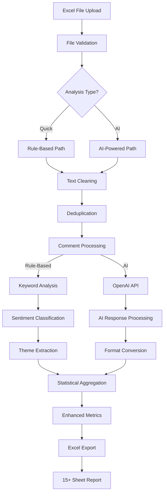

# Excel Pipeline Sequential Trace - Comment Analyzer System
## From Excel Ingestion to AI Processing - Complete Flow Analysis

---

## 📊 STAGE 1: FILE UPLOAD & INITIAL VALIDATION
**Location**: `src/main.py:1030-1043`

### 1.1 File Upload Widget
- **Component**: Streamlit file uploader
- **Accepted Types**: .xlsx, .xls, .csv
- **Entry Point**: User drops/selects Excel file
- **State Management**: File stored in `st.session_state.last_uploaded_file`

### 1.2 User Analysis Selection
**Location**: `src/main.py:1045-1112`
- **Quick Analysis Path**: Rule-based processing
- **AI Analysis Path**: OpenAI GPT-4 powered processing
- **Decision Point**: User clicks either "Análisis Rápido" or "Análisis con IA"

---

## 📁 STAGE 2: FILE INGESTION & VALIDATION
**Location**: `src/services/file_upload_service.py`

### 2.1 Basic File Validation
**Method**: `FileUploadService.validate_file_basic()` (lines 24-56)
- **Size Check**: Max 50MB limit
- **Format Check**: Validates extension (.xlsx, .xls, .csv, .json, .txt)
- **Metadata Extraction**: 
  - File size in MB
  - Extension type
  - File name
  - Size in bytes

### 2.2 File Processing Router
**Method**: `FileUploadService.process_uploaded_file()` (lines 98-138)
- **Save to Temp**: File saved to `data/raw/` directory
- **Format Detection**: Routes to appropriate processor
- **Excel Route**: → `_process_excel_file()`
- **CSV Route**: → `_process_regular_file()`

### 2.3 Excel-Specific Processing
**Method**: `FileUploadService._process_excel_file()` (lines 140-189)
- **Multi-Sheet Detection**: Identifies all sheets in workbook
- **Sheet Selection**: Allows user to choose sheet if multiple
- **Data Extraction**: Passes to CommentReader for parsing

---

## 📝 STAGE 3: DATA EXTRACTION & PARSING
**Location**: `src/data_processing/comment_reader.py`

### 3.1 Excel Reading Strategy
**Method**: `CommentReader._read_excel()` (lines 141-215)

#### 3.1.1 File Size Detection
- **Threshold**: 50MB
- **Small Files**: Direct pandas read
- **Large Files**: Chunked processing → `_read_excel_chunked()`

#### 3.1.2 Column Identification
**Search Priority** (lines 156-178):
1. Look for comment columns by name:
   - 'comentario final'
   - 'comentario'
   - 'comment'
   - 'comentarios'
   - 'feedback'
   - 'texto'
   - 'opinion'
   - 'observacion'

2. Fallback to first text column if no match

#### 3.1.3 Metadata Extraction
**Additional Columns** (lines 186-193):
- **NPS Column**: 'NPS' → categorical data
- **Rating Column**: 'Nota', 'score', 'puntuacion', 'rating' → numeric
- **Other Metadata**: All non-comment columns → `metadata_*` prefix

### 3.2 Data Standardization
**Output DataFrame Structure**:
```python
{
    'Comentario Final': str,     # Main comment text
    'source': str,                # 'excel', 'csv', etc.
    'file_name': str,             # Original filename
    'Nota': float (optional),     # Rating if available
    'NPS': str (optional),        # NPS category if available
    'metadata_*': any             # Other columns from Excel
}
```

### 3.3 Data Cleaning
**Method**: Lines 200-202
- Remove empty comments
- Remove 'nan' strings
- Strip whitespace
- Memory optimization via `OptimizedDataFrame.optimize_dtypes()`

---

## 🧹 STAGE 4: TEXT PREPROCESSING
**Location**: `src/main.py:process_uploaded_file()`

### 4.1 Text Cleaning
**Method**: `clean_text()` (lines 268-393)

#### 4.1.1 Orthographic Corrections
**Spanish Corrections Dictionary** (276-346):
- Common telecom typos: 'internert' → 'internet'
- Missing accents: 'rapido' → 'rápido'
- Service issues: 'se cae', 'se corta', 'muy caro'
- Total: 100+ correction patterns

#### 4.1.2 Cleaning Operations
1. Word-by-word correction
2. Preserve capitalization
3. Preserve punctuation
4. Clean multiple spaces
5. Clean excessive punctuation

### 4.2 Deduplication
**Method**: `remove_duplicates()` (lines 395-423)
1. Convert to lowercase for comparison
2. Count frequency of each comment
3. Remove exact duplicates (keep first)
4. Filter comments < 3 words
5. Remove non-alphabetic comments
6. Return unique comments with frequency counts

**Output**:
- Unique comment list
- Frequency dictionary for each comment

---

## 🤖 STAGE 5: ANALYSIS ROUTING
**Decision Point**: `src/main.py:1062-1112`

## PATH A: RULE-BASED ANALYSIS

### A.1 Sentiment Analysis
**Method**: `analyze_sentiment_simple()` (lines 185-266)

#### Keyword Lists:
- **Positive**: 30+ Spanish positive words
- **Negative**: 80+ Spanish negative words/phrases
- **Negative Phrases**: Double weight for multi-word patterns

#### Algorithm:
1. Count positive keywords
2. Count negative keywords (1x weight)
3. Count negative phrases (2x weight)
4. Compare counts for classification
5. Check subtle indicators for ties

### A.2 Theme Extraction
**Method**: `extract_themes()` (lines 425-449)

**Theme Categories**:
- `velocidad_lenta`: Speed issues
- `intermitencias`: Connection drops
- `atencion_cliente`: Customer service
- `precio`: Pricing concerns
- `cobertura`: Coverage issues
- `instalacion`: Installation problems

**Process**:
1. Search for keywords in each comment
2. Count theme occurrences
3. Collect top 3 examples per theme

## PATH B: AI-POWERED ANALYSIS

### B.1 AI Adapter Interface
**Location**: `src/ai_analysis_adapter.py`

#### B.1.1 AI Availability Check
**Method**: `AIAnalysisAdapter.__init__()` (lines 41-72)
1. Check for OpenAI API key
2. Initialize OpenAI analyzer
3. Set `ai_available` flag
4. Fallback to rule-based if unavailable

#### B.1.2 File Processing
**Method**: `process_uploaded_file_with_ai()` (lines 74-200)
1. Read Excel/CSV file
2. Find comment column
3. Clean and deduplicate
4. Route to AI or fallback

### B.2 OpenAI Processing
**Location**: `src/sentiment_analysis/openai_analyzer.py`

#### B.2.1 Batch Preparation
**Method**: `analyze_comments_batch()` (lines 45-113)
1. Check cache for existing results
2. Pre-detect languages (Spanish/Guarani)
3. Optimize batch sizes
4. Apply rate limiting

#### B.2.2 API Call Structure
**Method**: `_analyze_batch_openai()` (lines 214-300)

**Prompt Engineering**:
```python
For each comment analyze:
1. Sentiment: positive/negative/neutral
2. Confidence: 0.0-1.0
3. Language: es/gn/mixed
4. Translation: If Guarani → Spanish
5. Key themes: Max 3 topics
6. Pain points: Specific problems
7. Emotions: Primary emotions
```

**API Configuration**:
- Model: `gpt-4o-mini` (cost-effective)
- Temperature: 0.1 (consistent results)
- Max tokens: 4000
- Response format: JSON array

#### B.2.3 Response Processing
1. Parse JSON response
2. Validate structure
3. Extract all fields
4. Handle parsing errors with defaults

### B.3 Result Conversion
**Method**: `_convert_ai_results_to_expected_format()` (lines 264-515)

#### Conversion Mappings:
1. **Sentiment**: 'positive' → 'positivo', 'negative' → 'negativo'
2. **Emotions**: AI emotions → intensity scores
3. **Themes**: AI themes → extended theme structure
4. **Pain Points**: → Churn risk assessment
5. **Urgency**: Sentiment + pain points → P0/P1/P2/P3
6. **Competitors**: Theme scanning for competitor names
7. **Customer Value**: Confidence + themes → vip/growth/standard/budget

---

## 📊 STAGE 6: ENHANCED ANALYSIS
**Location**: `src/enhanced_analysis.py` & `src/improved_analysis.py`

### 6.1 Churn Risk Analysis
**Scoring System**:
- High risk indicators: +3 points
- Medium risk indicators: +2 points
- Low risk indicators: +1 point
- Score → risk_level: high/medium/low
- Probability calculation: score * 11.1%

### 6.2 NPS Calculation
**Methods**:
1. If NPS column exists: Use actual data
2. From sentiment: Map sentiment + intensity to 0-10 scale
3. Calculate: (Promoters - Detractors) / Total * 100

### 6.3 Quality Metrics
- Comment quality: detailed/moderate/non_informative
- Service issues: critical/high/medium/low severity
- Customer satisfaction index (CSI)

---

## 📈 STAGE 7: STATISTICAL AGGREGATION
**Location**: `src/main.py:552-733`

### 7.1 Core Metrics
```python
{
    'total': int,                    # Total unique comments
    'positive_pct': float,           # % positive sentiment
    'neutral_pct': float,            # % neutral sentiment
    'negative_pct': float,           # % negative sentiment
    'theme_counts': dict,            # Theme frequencies
    'theme_examples': dict,          # Example comments per theme
}
```

### 7.2 Enhanced Metrics
```python
{
    'nps': {
        'score': float,              # -100 to 100
        'promoters': int,
        'detractors': int,
        'passives': int
    },
    'churn_analysis': {
        'high_risk': int,
        'medium_risk': int,
        'low_risk': int
    },
    'urgency_distribution': dict,    # P0/P1/P2/P3 counts
    'competitor_analysis': dict,     # Competitor mentions
    'emotion_summary': dict,         # Emotion distribution
}
```

### 7.3 AI-Specific Metadata
```python
{
    'analysis_method': str,          # 'AI_POWERED' or 'RULE_BASED'
    'ai_model_used': str,            # 'gpt-4o-mini' or None
    'ai_confidence_avg': float       # Average AI confidence
}
```

---

## 📤 STAGE 8: EXCEL EXPORT
**Location**: `src/professional_excel_export.py`

### 8.1 Export Structure (15+ sheets)
1. **Cover Page**: Title, metadata, summary
2. **Executive Summary**: Key findings, recommendations
3. **Methodology**: Analysis approach used
4. **KPI Dashboard**: Visual metrics overview
5. **NPS Analysis**: Promoter/detractor breakdown
6. **Sentiment Analysis**: Distribution and trends
7. **Emotion Analysis**: Emotional patterns
8. **Theme Analysis**: Topic frequencies
9. **Service Issues**: Problem categorization
10. **Competitor Analysis**: Competitive mentions
11. **Churn Risk**: At-risk customer analysis
12. **Action Plan**: Recommended actions
13. **Detailed Comments**: All processed comments
14. **Statistics**: Data quality metrics
15. **Glossary**: Term definitions
16. **Appendix**: Additional data

### 8.2 Formatting Features
- Color coding by severity/sentiment
- Conditional formatting
- Charts and visualizations
- Frozen headers
- Column auto-width
- Professional styling

---

## 🔄 COMPLETE FLOW SUMMARY



---

## 🎯 KEY PERFORMANCE OPTIMIZATIONS

1. **Memory Management**:
   - Chunked processing for files >50MB
   - DataFrame dtype optimization
   - Garbage collection after large operations

2. **API Optimization**:
   - Batch processing (25-50 comments)
   - Response caching
   - Rate limiting (60 RPM)
   - Language pre-detection

3. **Processing Efficiency**:
   - Parallel theme detection
   - Vectorized operations where possible
   - Early filtering of invalid data

4. **Error Resilience**:
   - Fallback from AI to rule-based
   - Default values for failed operations
   - Comprehensive error logging

---

## 📊 DATA TRANSFORMATION SUMMARY

| Stage | Input | Output | Key Transformations |
|-------|-------|--------|---------------------|
| 1. Upload | Excel file | Binary data | File validation |
| 2. Ingestion | Binary data | Raw DataFrame | Column detection |
| 3. Extraction | Raw DataFrame | Standardized DataFrame | Column mapping |
| 4. Preprocessing | Raw text | Clean text | Orthographic correction, deduplication |
| 5. Analysis | Clean text | Sentiment + metadata | AI/Rule classification |
| 6. Enhancement | Basic analysis | Rich insights | Churn, NPS, urgency |
| 7. Aggregation | Individual results | Statistical summary | Percentages, distributions |
| 8. Export | Summary data | Excel report | Multi-sheet formatting |

---

## 🔍 DETAILED LOD (Level of Detail) TRACE POINTS

### Highest Detail Points:
1. **Comment column detection**: Tries 12 different column names
2. **Text cleaning**: 100+ correction patterns applied word-by-word
3. **AI prompt**: 276 lines of carefully crafted instructions
4. **Sentiment scoring**: Weighted keyword counting with phrase detection
5. **Churn risk**: Multi-factor scoring with probability calculation
6. **Excel generation**: 15+ sheets with conditional formatting

### Data Volume at Each Stage:
- **Input**: 1 Excel file (up to 50MB, 20,000 rows)
- **After cleaning**: ~80% of original (duplicates removed)
- **After filtering**: ~70% of original (short comments removed)
- **API batches**: 25-50 comments per call
- **Final output**: 1 Excel with 15+ sheets, ~200 metrics

This represents the complete sequential trace of the Excel pipeline from ingestion to AI processing with the highest level of detail available in the codebase.