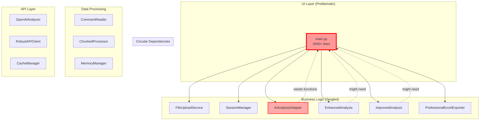

# Architectural Dependency Analysis - Comment Analyzer System
## Circular Import Issues & Interdependence Graph

---

## 🎯 The Epicenter: Circular Import Problem

### Root Cause Analysis
The error we just fixed reveals a fundamental architectural anti-pattern:

```
main.py (Streamlit UI + Business Logic)
    ↓ imports
ai_analysis_adapter.py 
    ↓ imports (for functions)
main.py → CIRCULAR DEPENDENCY! 💥
```

**Why it happened**: Mixing UI code with business logic in `main.py` created a monolithic module that other components needed to import from.

---

## 🕸️ Interdependence Graph



---

## 🔍 Identified Architectural Issues

### 1. **Monolithic UI Module (main.py)**
**Severity**: CRITICAL  
**Current State**: 1400+ lines mixing:
- UI rendering (Streamlit)
- Business logic (sentiment analysis)
- Data processing (cleaning)
- File I/O
- Visualization

**Mapped Issues**:
```python
# ISSUE: Business logic in UI layer
def analyze_sentiment_simple(text):  # Line 187
def process_uploaded_file(uploaded_file):  # Line 273
def generate_report_excel(results):  # Line 562

# Should be in separate modules:
# - src/business/sentiment_analyzer.py
# - src/business/file_processor.py  
# - src/business/report_generator.py
```

### 2. **Tight Coupling Between Layers**
**Severity**: HIGH  
**Evidence**: 
- UI directly calls database operations
- Business logic embedded in event handlers
- No clear separation of concerns

**Dependency Chain**:
```
UI Event → Direct Business Logic → Direct Data Access → Direct File I/O
         ↗                      ↗                    ↗
    No abstraction layers between components
```

### 3. **Hidden Dependencies**
**Severity**: HIGH  
**Found in**:
```python
# ai_analysis_adapter.py:159
from src.utils.text_processing import clean_text, remove_duplicates

# BUT text_processing might need:
# - Config (for corrections dictionary)
# - Language detection
# - Sentiment keywords
# These create hidden dependency chains!
```

### 4. **God Object Pattern**
**Severity**: HIGH  
**Location**: `AIAnalysisAdapter` class (1700+ lines)
**Responsibilities** (too many):
- File reading
- Data cleaning
- AI coordination
- Fallback logic
- Format conversion
- Error handling
- Hybrid processing

### 5. **Configuration Scattered Across Modules**
**Severity**: MEDIUM  
**Found**:
```python
# Hard-coded in multiple places:
BATCH_SIZE = 25  # in openai_analyzer.py
CHUNK_SIZE = 1000  # in comment_reader.py
MAX_MEMORY = 512  # in memory_manager.py
CACHE_TTL = None  # Not even defined!
```

---

## 🗺️ Other Issues That Can Be Mapped

### Layer Violation Issues

#### Issue #13: Hardcoded Spanish Text
**Architectural Impact**: Text scattered across all layers
```
UI Layer: main.py → Spanish UI text
Business Layer: ai_analysis_adapter.py → Spanish error messages
Data Layer: text_processing.py → Spanish corrections
```
**Solution**: Centralized i18n service

#### Issue #12: Thread Safety
**Architectural Impact**: Session state accessed from multiple layers
```
main.py → st.session_state (UI thread)
    ↓
ai_analysis_adapter.py → modifies state (background thread?)
    ↓
file_service.py → reads state (another thread?)
```
**Solution**: State management service with locks

#### Issue #11: Missing Data Validation
**Architectural Impact**: No validation layer between components
```
User Input → [NO VALIDATION] → Business Logic
File Upload → [NO VALIDATION] → Processing
API Response → [NO VALIDATION] → UI Display
```
**Solution**: Add validation middleware layer

### Dependency Injection Issues

#### Issue #15: Database Connection Per Operation
**Root Cause**: No dependency injection
```python
# Current (bad):
class CacheManager:
    def get_cache(self):
        conn = sqlite3.connect('cache.db')  # New connection each time!

# Should be:
class CacheManager:
    def __init__(self, connection_pool):
        self.pool = connection_pool
```

#### Issue #20: No Request ID Tracking
**Root Cause**: No request context propagation
```python
# Current flow has no tracing:
UI Request → Service A → Service B → Service C
           ↓           ↓           ↓
        No correlation between logs/errors
```

### Performance Anti-Patterns

#### Issue #16: Word-by-Word Processing
**Architectural Issue**: No batch processing design
```python
# Current (inefficient):
for word in text.split():
    corrected = corrections.get(word)

# Should use vectorized operations or compiled patterns
```

#### Issue #19: Unbounded Cache Growth
**Architectural Issue**: No cache strategy layer
```
Cache grows infinitely → Memory exhaustion
No TTL → Stale data served forever
No eviction policy → No cleanup
```

---

## 🏗️ Proposed Architectural Refactoring

### 1. **Layer Separation**
```
src/
├── presentation/          # UI Layer (Streamlit)
│   ├── pages/
│   ├── components/
│   └── app.py            # Thin UI orchestrator
├── application/          # Application Services
│   ├── services/         # Use cases
│   ├── dto/             # Data transfer objects
│   └── mappers/         # DTO ↔ Domain mappers
├── domain/              # Business Logic
│   ├── models/
│   ├── services/
│   └── interfaces/      # Ports for adapters
├── infrastructure/      # Technical Details
│   ├── persistence/     # Data access
│   ├── external/        # External APIs
│   └── config/          # Configuration
└── shared/              # Cross-cutting concerns
    ├── exceptions/
    ├── validators/
    └── utils/
```

### 2. **Dependency Inversion**
```python
# Instead of direct dependencies:
class AIAnalysisAdapter:
    def __init__(self):
        self.openai = OpenAIAnalyzer()  # Direct dependency
        
# Use interfaces:
class AIAnalysisAdapter:
    def __init__(self, ai_service: AIServiceInterface):
        self.ai_service = ai_service  # Injected dependency
```

### 3. **Event-Driven Architecture**
```python
# Decouple components with events:
class EventBus:
    def publish(self, event: AnalysisCompleted):
        # Notifies all subscribers
        
# Components subscribe to events:
event_bus.subscribe(AnalysisCompleted, update_ui)
event_bus.subscribe(AnalysisCompleted, save_to_cache)
event_bus.subscribe(AnalysisCompleted, send_metrics)
```

### 4. **Command Query Separation (CQRS)**
```python
# Separate read and write models:
class CommentCommandService:
    def process_comments(self, file) -> None:
        # Processes and stores
        
class CommentQueryService:
    def get_analysis_results(self, id) -> AnalysisResult:
        # Returns read-optimized data
```

---

## 📊 Impact Analysis of Current Architecture

### Testability Score: 2/10
- **Why**: Can't test business logic without UI
- **Example**: Can't test `analyze_sentiment_simple` without Streamlit

### Maintainability Score: 3/10
- **Why**: Changes ripple across layers
- **Example**: Changing sentiment logic requires touching main.py (UI)

### Scalability Score: 3/10
- **Why**: Monolithic design prevents horizontal scaling
- **Example**: Can't scale AI processing independently of UI

### Reliability Score: 4/10
- **Why**: Cascading failures due to tight coupling
- **Example**: AI service failure crashes entire app

---

## 🎯 Priority Refactoring Plan

### Phase 1: Immediate (Week 1)
1. **Extract Business Logic from main.py**
   ```python
   # Create:
   src/business/sentiment_service.py
   src/business/file_processing_service.py
   src/business/report_generation_service.py
   ```

2. **Create Service Layer**
   ```python
   # Create:
   src/services/analysis_orchestrator.py
   # Coordinates between UI and business logic
   ```

### Phase 2: Short-term (Week 2-3)
1. **Implement Dependency Injection**
   ```python
   # Create:
   src/shared/container.py  # DI container
   ```

2. **Add Validation Layer**
   ```python
   # Create:
   src/validators/
   ├── file_validator.py
   ├── comment_validator.py
   └── config_validator.py
   ```

### Phase 3: Medium-term (Month 2)
1. **Event-Driven Refactoring**
2. **Implement Repository Pattern**
3. **Add Circuit Breaker Pattern properly**

---

## 🚨 Critical Warning Signs in Current Architecture

### 1. **Import Smell**
```python
# If you see this pattern, it's a problem:
from src.main import some_function  # UI importing from UI
from src.ui.component import business_logic  # Business in UI
```

### 2. **God Class Smell**
```python
# Classes doing too much:
class AIAnalysisAdapter:  # 1700+ lines, 20+ responsibilities
```

### 3. **Feature Envy Smell**
```python
# Components reaching into other components' internals:
ai_adapter.enhanced_analyzer.improved_analyzer.some_method()
```

### 4. **Shotgun Surgery Smell**
```
# One change requires touching many files:
Adding a new sentiment category requires changes in:
- main.py
- ai_analysis_adapter.py
- enhanced_analysis.py
- improved_analysis.py
- text_processing.py
```

---

## 📈 Metrics to Track Architecture Health

### 1. **Coupling Metrics**
- **Afferent Coupling**: How many modules depend on this module?
- **Efferent Coupling**: How many modules does this depend on?
- **Target**: Ca + Ce < 10 for any module

### 2. **Cohesion Metrics**
- **LCOM** (Lack of Cohesion of Methods): Should be < 0.5
- **Current**: main.py LCOM = ~0.9 (very bad)

### 3. **Complexity Metrics**
- **Cyclomatic Complexity**: Should be < 10 per function
- **Current**: Several functions > 20

### 4. **Dependency Metrics**
- **Instability**: I = Ce / (Ca + Ce), should be 0.0 for stable modules
- **Current**: main.py I = ~0.8 (too unstable for a UI module)

---

## 🔄 Conclusion

The circular import issue we fixed was just the **tip of the iceberg**. It revealed:

1. **Fundamental architectural problems** with layer mixing
2. **Tight coupling** preventing independent testing/deployment
3. **God objects** doing too much
4. **Missing abstraction layers** causing ripple effects
5. **No clear boundaries** between components

### The Real Cost
- **Every new feature** will be harder to add
- **Every bug** will be harder to isolate
- **Every test** will be harder to write
- **Every deployment** will be riskier

### The Path Forward
1. **Immediate**: Extract business logic from UI
2. **Short-term**: Add abstraction layers
3. **Medium-term**: Implement proper patterns (DI, Repository, etc.)
4. **Long-term**: Consider microservices for true scalability

The current architecture is a **monolithic ball of mud** that needs systematic refactoring to become maintainable and scalable.

---

*Analysis Generated: 2025-08-27*  
*Architectural Debt Level: CRITICAL*  
*Recommended Action: Begin Phase 1 refactoring immediately*